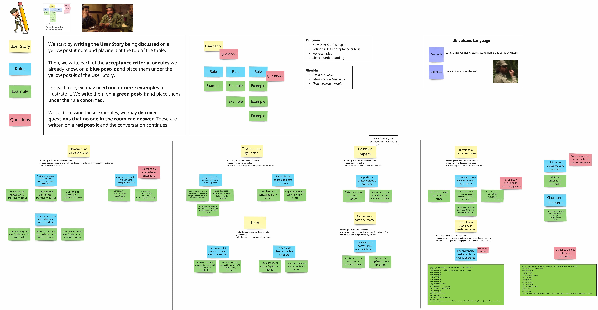

# Refactoring du Bouchonnois
Work in progress pour créer 1 kata de refactoring du bouchonnois...

## Starting Point
- Anemic model
	- State (EnCours, Apero, Fini)
- Pas d'encapsulation
- Faible qualité dans les tests
- Primitives partout
- Service "poubelle"

## A démontrer
✅Example Mapping du Bouchonnois
- Tell Don't Ask
- Test Data Builders
- Approval Tests pour status
- Mutation Testing
✅ FluentAssertions
- Avoid Primitives
- Parse Don't Validate
- Higher Order Function
- Fuzzier
- Use Case
- Immutability
- No Exceptions -> Monads
	- Mapping vers Controller?
- Property-Based Testing
- ADR pour Event Sourcing
- ArchUnit rules
- Encapsulation : Event Sourcing
	- Event Bus avec MediatR
	- SignalR pour pusher les events

	
## To Do
- Montrer l'état initial Sonar / Codescene
- Treat all warnings as errors
- Refactor tests hotspots
  - Screaming architecture / tests
- Test Data Builders
- Utiliser Fuzzier -> nom par exemple
- From Example Based Testing to PBT
	- Pour les failures -> PBT
	- Améliorer la gestion des cas négatifs
- Approval Testing pour ScenarioTests
- ...
- Ensuite aller dans le code de prod

## Example Mapping
Découvrir c'est quoi l'Example Mapping [ici](https://xtrem-tdd.netlify.app/Flavours/example-mapping).

Ci-dessous, l'Example Mapping qui a servi d'alignement à notre équipe du Bouchonnois afin de développer ce système.

Version PDF disponible [ici](example-mapping/example-mapping.pdf)
