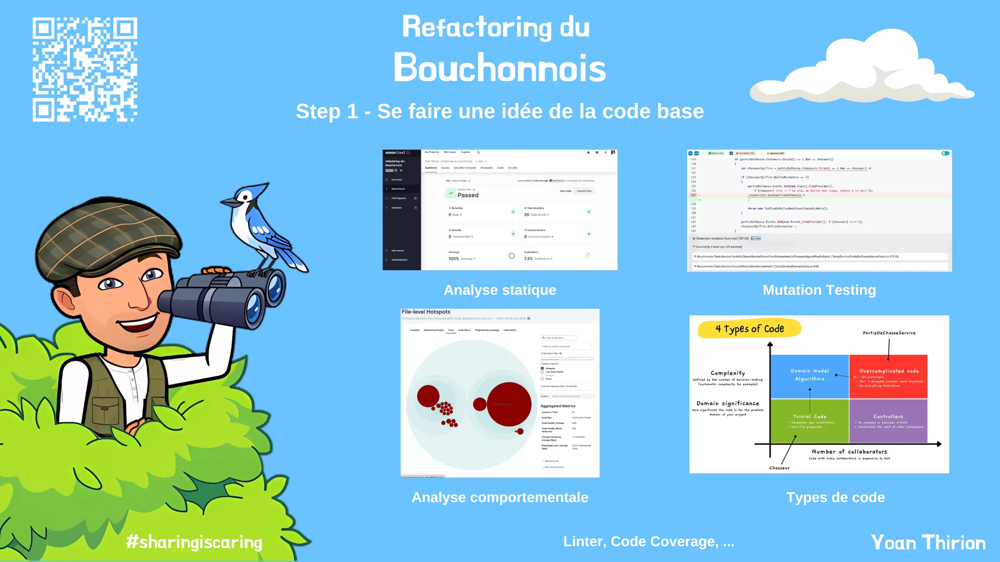

# Se faire une idée de la code base
Imagine que tu dois reprendre la maintenance évolutive du système de gestion des parties de chasse de nos chers chasseurs du bouchonnois.
Afin de te faire un premier feeling sur le code, on va analyser certains éléments factuels.

## Check-list
Essayez de construire 1 chek-list d'éléments à analyser / mettre en place pour :
- Comprendre la solution
- Identifier les axes d'amélioration

## Analyser
- Que nous dit notre compilateur ?
- Comment est structurer la solution ?
- Quelles sont les références ?
- Quel est le code coverage ?
- Que pouvons nous apprendre sur le code grâce au résultat de l'analyse static de code disponible [ici](https://sonarcloud.io/summary/overall?id=ythirion_refactoring-du-bouchonnois)?
- Que pouvons nous apprendre à partir du résultat de l'analyse comportementale du code disponible [ici](https://codescene.io/projects/39213)?
- Que pensez-vous de la qualité des tests et leurs fiabilités ?

## Reflect
Prendre du temps pour regarder / comprendre les différentes conclusions reprises dans cette [page](steps/01.gather-metrics.md).

