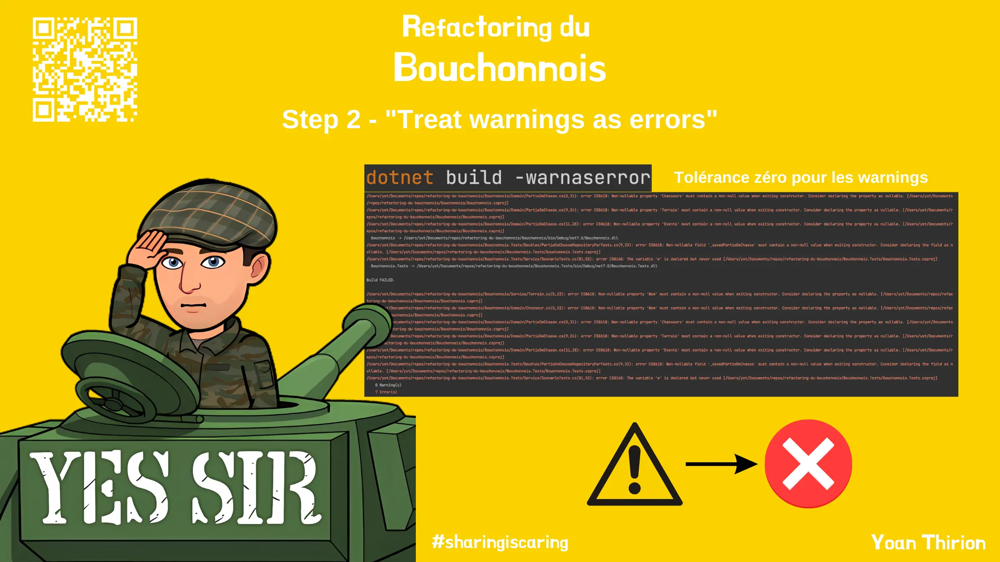

# "Treat warnings as errors"
Prendre quelques instants pour découvrir la page [`Treat warnings as errors`](https://xtrem-tdd.netlify.app/Flavours/practices/treat-warnings-as-errors).

Durant cette étape:
- Configurer la compilation pour traiter les warnings comme des erreurs à la compilation
- Corriger les erreurs de compilation

> Comment aurait-on pu faire en sorte que les tests soient moins résistants aux refactorings du code de prod ?

## Reflect
> Comment aurait-on pu faire en sorte que les tests soient moins résistants aux refactorings du code de prod ?

Quels autres problèmes avions nous identifier et devrions nous corriger avant d'aller plus loin?

## Solution
Guide étape par étape disponible [ici](steps/02.treat-warnings-as-errors.md).
