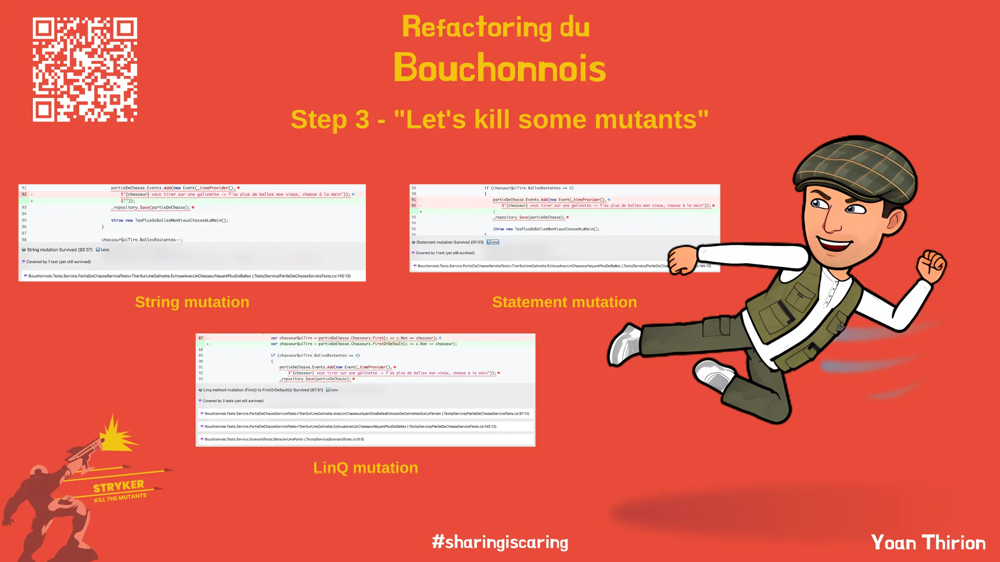

# Let's kill some mutants
Prendre quelques instants pour découvrir la page [`Mutation Testing`](https://xtrem-tdd.netlify.app/flavours/mutation-testing/).

Durant cette étape:
- Lancer [`stryker`](https://stryker-mutator.io/docs/stryker-net/introduction/)
  - Analyser les mutants survivants 
- `Tuer` autant de mutants que possible (atteindre un score de mutation d'au moins 90%)

## Reflect
Pour créer de bons tests, il est important de `toujours se concentrer sur l'écriture de bonnes assertions` et encore mieux développer en utilisant T.D.D.

Lorsqu'on écrit des tests (a priori ou posteriori), il est important d'avoir en tête certains principes tels que les [Test Desiderata](https://kentbeck.github.io/TestDesiderata/).

## Solution
Guide étape par étape disponible [ici](steps/03.kill-mutants.md).