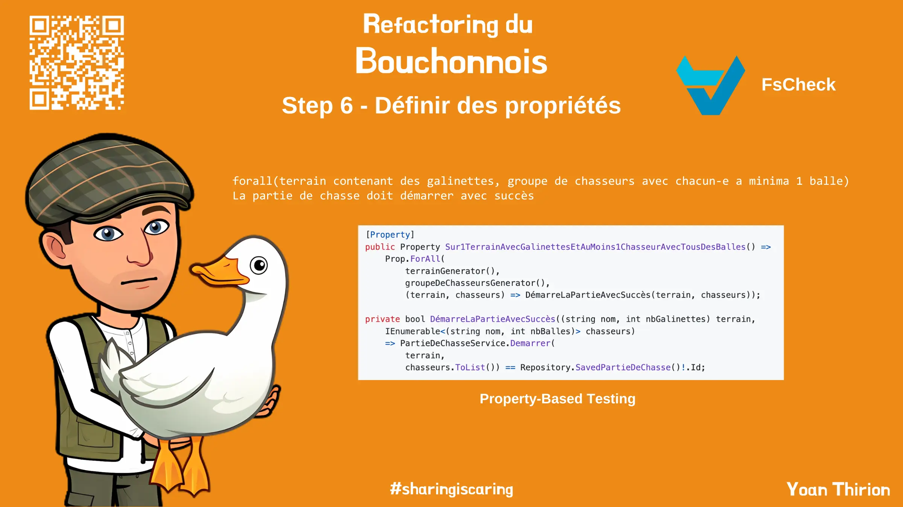

# Définir des propriétés
Avant de nous lancer dans notre refactoring, on peut encore aller plus loin sur nos tests afin d'améliorer encore notre confiance vis-à-vis de notre code base.

Pour ce faire on va écrire des `tests de propriétés` :
- Prendre du temps pour comprendre ce qu'est le [`Property-Based Testing`](https://xtrem-tdd.netlify.app/Flavours/testing/pbt)
- Quelles propriétés peut-on identifier à partir de notre `Example Mapping` ?
- Ecrire des tests de propriétés en utilisant la librairie [FsCheck](https://fscheck.github.io/FsCheck/Properties.html)

## Reflect
- Que pensez vous de cette technique ?
- Quelles sont ses avantages ?
- Comment vous pourriez l'utiliser ?

## Solution
Guide étape par étape disponible [ici](steps/06.properties.md).