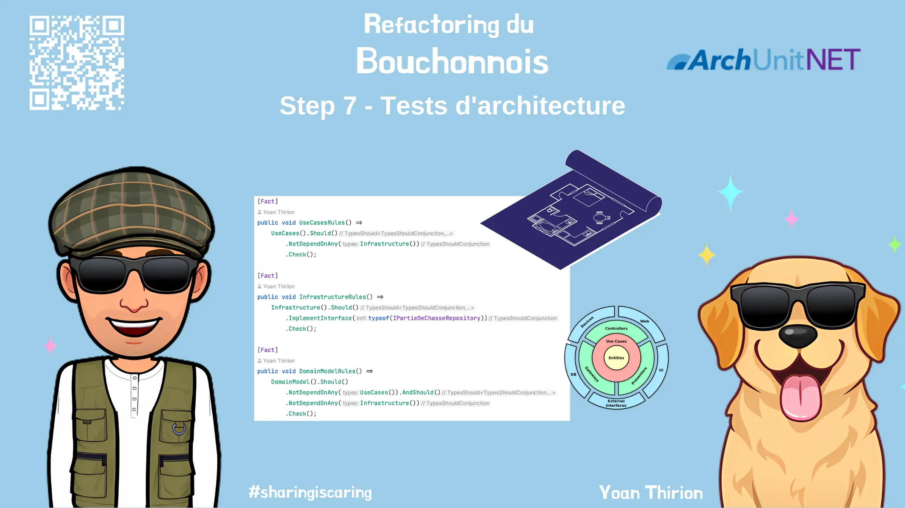

# Tests d'architecture
Avec toutes les découvertes réalisées jusqu'à présent on a pu se rendre compte que l'architecture désirée était une architecture en `Onion` :


On va s'assurer que le code actuel respecte le Design escompté :  
- Prendre du temps pour comprendre ce que sont des [`Architecture Unit Tests`](https://xtrem-tdd.netlify.app/Flavours/Architecture/archunit)
- Ecrire des tests d'architecture en utilisant la librairie [ArchUnit](https://github.com/TNG/ArchUnitNET/)



Pour aller plus vite, voici une classe contenant des extensions facilitant l'écriture et le lancement de tels tests :

```csharp
using ArchUnitNET.Fluent;
using ArchUnitNET.Fluent.Syntax.Elements.Types;
using ArchUnitNET.Loader;
using ArchUnitNET.xUnit;
using Bouchonnois.Service;
using static ArchUnitNET.Fluent.ArchRuleDefinition;

namespace Bouchonnois.Tests.Architecture
{
    public static class ArchUnitExtensions
    {
        private static readonly ArchUnitNET.Domain.Architecture Architecture =
            new ArchLoader()
                .LoadAssemblies(typeof(PartieDeChasseService).Assembly)
                .Build();

        public static GivenTypesConjunction TypesInAssembly() =>
            Types().That().Are(Architecture.Types);

        public static void Check(this IArchRule rule) => rule.Check(Architecture);
    }
    
    // Exemple de test
    public class Guidelines
    {
        private static GivenMethodMembersThat Methods() => MethodMembers().That().AreNoConstructors().And();

        [Fact]
        public void NoGetMethodShouldReturnVoid() =>
            Methods()
                .HaveName("Get[A-Z].*", useRegularExpressions: true).Should()
                .NotHaveReturnType(typeof(void))
                .Check();
    }
}
```

## Reflect
- A quoi cette technique pourrait vous servir ?
- Quelles règles pourraient être utiles dans votre quotidien ?


## Solution
Guide étape par étape disponible [ici](steps/07.architecture-tests.md).