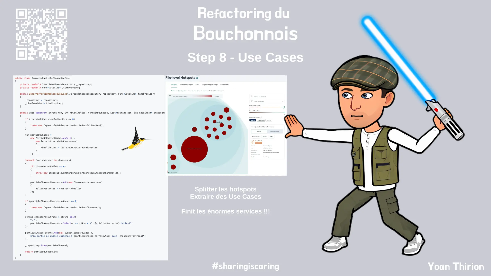

# Use Cases
Maintenant que nous sommes confiants vis-à-vis de nos tests nous allons pouvoir commencer à refactorer.

Nous pouvons démarrer en `splittant` notre principal hostpot : `PartieDeChasseService`.

Pour ce faire, nous allons utiliser la stratégie `Divide and Conquer` :
- Prendre du temps pour comprendre ce qu'est la [`Clean Architecture`](https://xtrem-tdd.netlify.app/Flavours/Architecture/clean-architecture)
  - Notamment la notion de `Use Case`
- Extraire 1 `Use Case` par méthode du `Service`
- Améliorer la définition de notre architecture via nos tests `Archunit`

## Reflect
- Quel est l'impact sur le design ? les tests ?
- En quoi pouvons nous parler ici de `Screaming Architecture` ?

## Solution
Guide étape par étape disponible [ici](steps/08.use-cases.md).