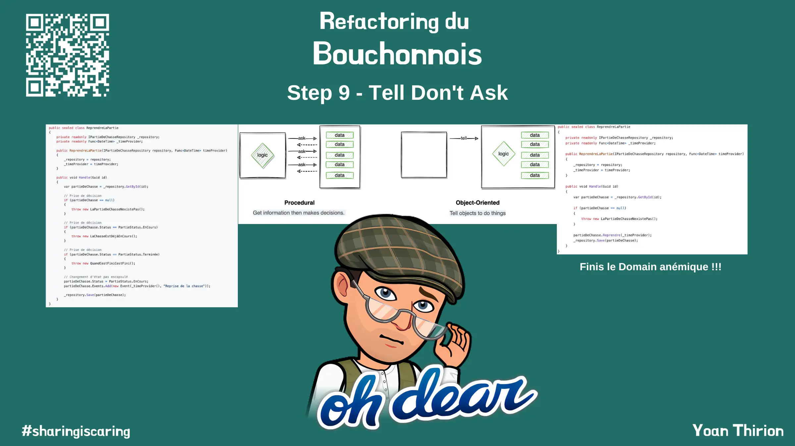

# Tell Don't Ask


Le code des `Use Cases` ressemble pour le moment furieusement à du code procédural en :
- interrogeant des objets
- prenant des décisions basées sur l'état de ces objets


Voici un exemple avec un `Use Case` existant :
```csharp
public sealed class ReprendreLaPartie
{
    private readonly IPartieDeChasseRepository _repository;
    private readonly Func<DateTime> _timeProvider;

    public ReprendreLaPartie(IPartieDeChasseRepository repository, Func<DateTime> timeProvider)
    {
        _repository = repository;
        _timeProvider = timeProvider;
    }

    public void Handle(Guid id)
    {
        var partieDeChasse = _repository.GetById(id);

        // Prise de décision
        if (partieDeChasse == null)
        {
            throw new LaPartieDeChasseNexistePas();
        }

        // Prise de décision
        if (partieDeChasse.Status == PartieStatus.EnCours)
        {
            throw new LaChasseEstDéjàEnCours();
        }

        // Prise de décision
        if (partieDeChasse.Status == PartieStatus.Terminée)
        {
            throw new QuandCestFiniCestFini();
        }

        // Changement d'état pas encapsulé
        partieDeChasse.Status = PartieStatus.EnCours;
        partieDeChasse.Events.Add(new Event(_timeProvider(), "Reprise de la chasse"));
        
        _repository.Save(partieDeChasse);
    }
}
```

Nous allons encapsuler la prise de décision au niveau du `Domain` et faire en sorte que les `Use Cases` respectent le principe `Tell Don't Ask` :
- Prendre du temps pour comprendre ce qu'est le principe [`Tell Don't Ask`](https://xtrem-tdd.netlify.app/Flavours/Design/tell-dont-ask)
- Encapsuler le code `Business` des `Use Cases` dans le `Domain`
- Revoir l'encapsulation des objets afin de préserver l'état du `Domain`
  - Rendre impossible de représenter un état invalide
  - Avoir des objets métiers porteurs de sens

## Reflect
- Quel impact ce refactoring a eu sur les tests ?
- Qu'est-ce qui est plus simple / compliqué maintenant ?


## Solution
Guide étape par étape disponible [ici](steps/09.tell-dont-ask.md).