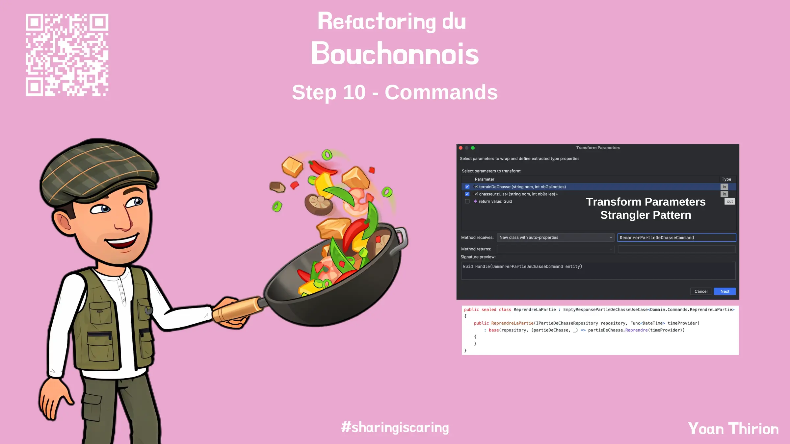

# "Avoid Primitives" - Commands
Nous avons encore du travail quant aux entrants de notre système.  
Celui-ci ne prend en paramètre que des types primitifs avec des signatures de méthodes :
- difficiles à faire évoluer
  - listes de Tuples...
- pouvant être cryptiques et donc avec un `fort impact cognitif`

```csharp
public Guid Handle((string nom, int nbGalinettes) terrainDeChasse, List<(string nom, int nbBalles)> chasseurs)
public void Handle(Guid id, string chasseur)
```



Il existe un moyen d'éviter ce phénomène : les "objets".  

En l'occurence nous allons encapsuler ce qui est handlé par nos Use Cases dans des objets de type `Command` :
- Prendre du temps pour comprendre ce qu'est le principe [`Avoid Primitive Types`](https://xtrem-tdd.netlify.app/Flavours/Design/no-primitive-types)
- Commencer par refactorer le code du Use Case `DemarrerPartieDeChasse`

> Si nous avions une couche d'exposition au-dessus, nous devrions mapper les DTOs en entrée vers nos commandes afin de préserver l'encapsulation et pouvoir faire évoluer notre Domain sans impacter les couches supérieures.

## Reflect
- Où avez-vous placé les classes de type `Command` dans votre solution ?
- Quel impact ce refactoring a eu ?


## Solution
Guide étape par étape disponible [ici](steps/10.commands.md).