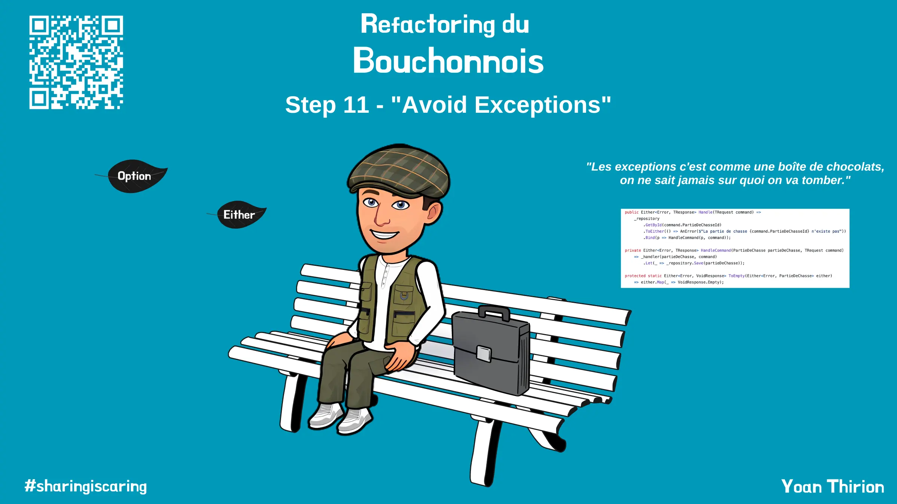

# "Avoid Exceptions"


`Quel est le problème avec ce code ?`

```csharp
tirerUseCase.Handle(new Domain.Commands.Tirer(id, Data.Bernard));

public TResponse Handle(TRequest command)
{
    var partieDeChasse = _repository.GetById(command.PartieDeChasseId);

    if (partieDeChasse == null)
    {
        throw new LaPartieDeChasseNexistePas();
    }

    var response = _handler(partieDeChasse, command);
    _repository.Save(partieDeChasse);

    return response;
}
```

Si on regarde la signature de la méthode `Handle` : 
- `TRequest` -> `TResponse`
  - Que l'on peut traduire par : `Pour tout TRequest je te retourne 1 TResponse`
  - Ce qui est faux puisque cette méthode et la méthode d'handling peuvent lancer des exceptions
- La signature de cette méthode ne représente pas de manière explicite les sorties possibles de cette dernière

Souvent notre code contient ce genre de `mensonges`... 


Pour aller plus loin sur ce sujet je t'invite à regarder la super conférence de [Scott Wlaschin](https://www.linkedin.com/in/scottwlaschin/) sur le sujet : [Functional Design Patterns](https://youtu.be/srQt1NAHYC0).

Nous allons chercher à rendre ce code plus explicite en :
- Évitant l'utilisation à outrance des `Exception`
  - Elles sont beaucoup trop utilisés pour représenter des cas d'erreurs business sous contrôles
- Les remplaçant par des retours de type `Error`
- Utilisant les fameuses `Monads`

## Comment ?
- Prendre du temps pour lire ces pages :
  - [Avoid Exceptions](https://xtrem-tdd.netlify.app/Flavours/Design/avoid-exceptions)
  - [Monads](https://xtrem-tdd.netlify.app/Flavours/Design/monads)
- À l'aide de `T.D.D` et du `Strangler` pattern, refactorer le `Use Case` `Tirer` afin que la signature de `Handle` ressemble à :
  - `TRequest` -> `Either<Error, TResponse>`
  - soit `Commands.Tirer` -> `Either<Error, VoidResponse>`
    - On limitera le type `Error` à 1 message décrivant l'erreur qui s'est produite

## Reflect
- Qu'est-ce que vous pensez des `Monads` ?
- Quel est leur impact sur notre code ?
- Quel impact ce refactoring a eu ?


## Solution
Guide étape par étape disponible [ici](steps/11.avoid-exceptions.md).