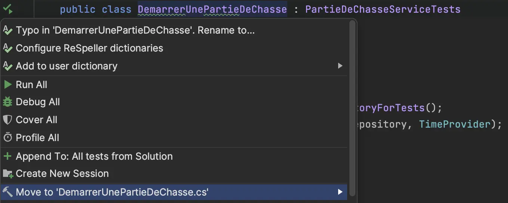
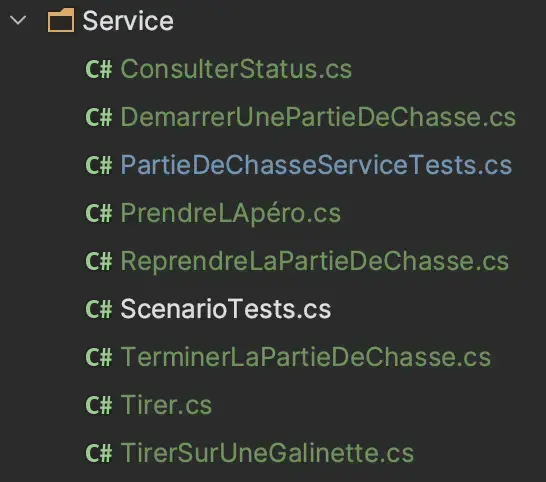
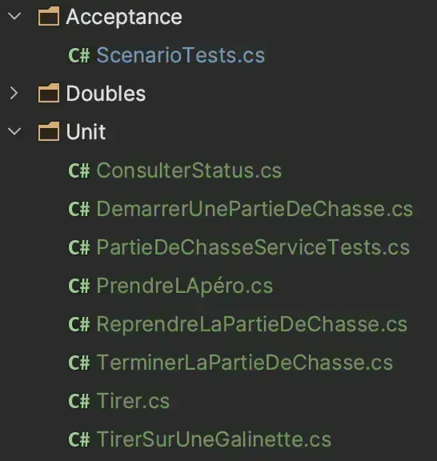
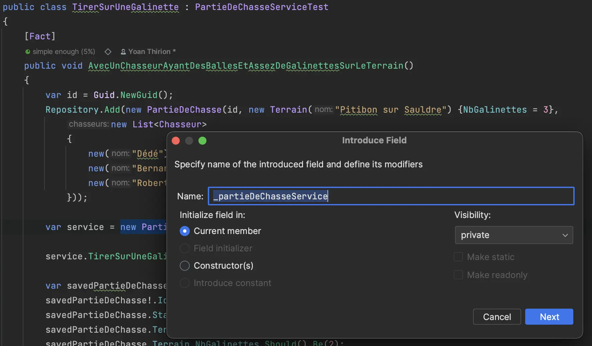
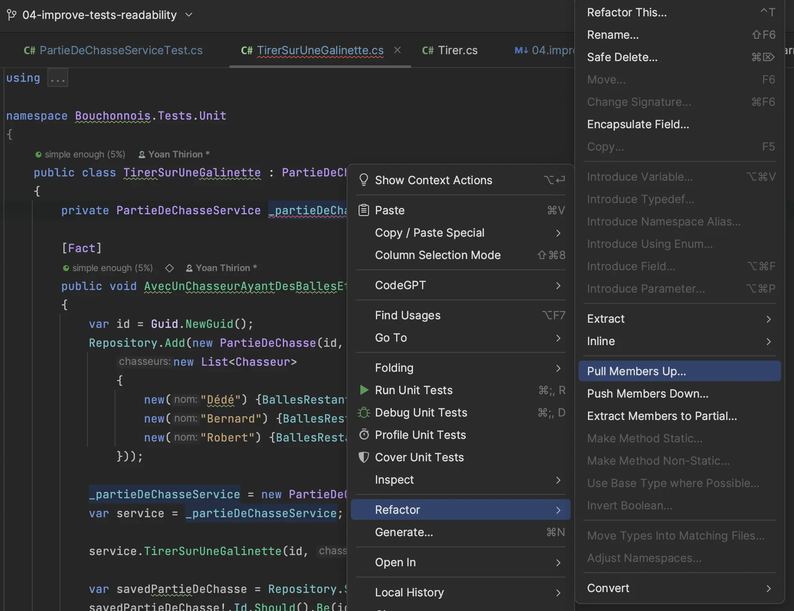
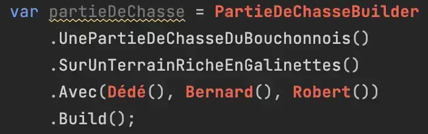
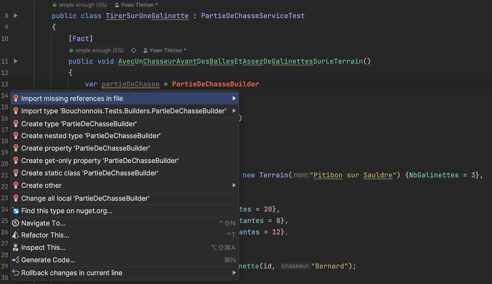

# Améliorer la lisibilité des tests
Les tests sont, pour l'instant, assez difficiles à comprendre :
- 1 classe de tests avec `948 loc`
- Il y a de la duplication partout
- Ce qui influe le résultat du test n'est pas mis en évidence

Prenons un exemple pour illustrer celà :
```csharp
public class TirerSurUneGalinette
{
    [Fact]
    public void AvecUnChasseurAyantDesBallesEtAssezDeGalinettesSurLeTerrain()
    {
        // Début duplication 1
        var id = Guid.NewGuid();
        var repository = new PartieDeChasseRepositoryForTests();

        repository.Add(new PartieDeChasse(id, new Terrain("Pitibon sur Sauldre") {NbGalinettes = 3},
            new List<Chasseur>
            {
                new("Dédé") {BallesRestantes = 20},
                new("Bernard") {BallesRestantes = 8},
                new("Robert") {BallesRestantes = 12},
            }));

        var service = new PartieDeChasseService(repository, TimeProvider);
        // Fin duplication 1

        service.TirerSurUneGalinette(id, "Bernard");

        // Début duplication 2
        var savedPartieDeChasse = repository.SavedPartieDeChasse();
        savedPartieDeChasse!.Id.Should().Be(id);
        savedPartieDeChasse.Status.Should().Be(PartieStatus.EnCours);
        savedPartieDeChasse.Terrain.Nom.Should().Be("Pitibon sur Sauldre");
        savedPartieDeChasse.Terrain.NbGalinettes.Should().Be(2);
        // Ce qui devrait être mis en avant 1
        // Tirer sur une Galinette diminue le nombre de galinettes restantes sur le terrain
        savedPartieDeChasse.Chasseurs.Should().HaveCount(3);
        savedPartieDeChasse.Chasseurs[0].Nom.Should().Be("Dédé");
        savedPartieDeChasse.Chasseurs[0].BallesRestantes.Should().Be(20);
        savedPartieDeChasse.Chasseurs[0].NbGalinettes.Should().Be(0);
        savedPartieDeChasse.Chasseurs[1].Nom.Should().Be("Bernard");
        
        // Ce qui devrait être mis en avant 2
        // 1 balle en moins et 1 galinette pour Bernard
        savedPartieDeChasse.Chasseurs[1].BallesRestantes.Should().Be(7);
        savedPartieDeChasse.Chasseurs[1].NbGalinettes.Should().Be(1);
        
        savedPartieDeChasse.Chasseurs[2].Nom.Should().Be("Robert");
        savedPartieDeChasse.Chasseurs[2].BallesRestantes.Should().Be(12);
        savedPartieDeChasse.Chasseurs[2].NbGalinettes.Should().Be(0);
        // Fin duplication 2

        AssertLastEvent(savedPartieDeChasse, "Bernard tire sur une galinette");
    }
    ...
    
public class Tirer
{
    [Fact]
    public void AvecUnChasseurAyantDesBalles()
    {
        // Début duplication 1
        var id = Guid.NewGuid();
        var repository = new PartieDeChasseRepositoryForTests();

        repository.Add(new PartieDeChasse(id, new Terrain("Pitibon sur Sauldre") {NbGalinettes = 3},
            new List<Chasseur>
            {
                new("Dédé") {BallesRestantes = 20},
                new("Bernard") {BallesRestantes = 8},
                new("Robert") {BallesRestantes = 12},
            }));

        var service = new PartieDeChasseService(repository, TimeProvider);
        // Fin duplication 1
        
        service.Tirer(id, "Bernard");

        // Début duplication 2
        var savedPartieDeChasse = repository.SavedPartieDeChasse();
        savedPartieDeChasse!.Id.Should().Be(id);
        savedPartieDeChasse.Status.Should().Be(PartieStatus.EnCours);
        savedPartieDeChasse.Terrain.Nom.Should().Be("Pitibon sur Sauldre");
        savedPartieDeChasse.Terrain.NbGalinettes.Should().Be(3);
        savedPartieDeChasse.Chasseurs.Should().HaveCount(3);
        savedPartieDeChasse.Chasseurs[0].Nom.Should().Be("Dédé");
        savedPartieDeChasse.Chasseurs[0].BallesRestantes.Should().Be(20);
        savedPartieDeChasse.Chasseurs[0].NbGalinettes.Should().Be(0);
        savedPartieDeChasse.Chasseurs[1].Nom.Should().Be("Bernard");
        // Ce qui devrait être mis en avant
        // 1 balle en moins pour Bernard
        savedPartieDeChasse.Chasseurs[1].BallesRestantes.Should().Be(7);
        savedPartieDeChasse.Chasseurs[1].NbGalinettes.Should().Be(0);
        savedPartieDeChasse.Chasseurs[2].Nom.Should().Be("Robert");
        savedPartieDeChasse.Chasseurs[2].BallesRestantes.Should().Be(12);
        savedPartieDeChasse.Chasseurs[2].NbGalinettes.Should().Be(0);
        // Fin duplication 2

        AssertLastEvent(repository.SavedPartieDeChasse()!, "Bernard tire");
    }
}
```

## Splitter la classe de tests
- On commence par déplacer les classes de test à l'extérieur de `PartieDeChasseServiceTests`
- Chaque classe de test va maintenant hériter de `PartieDeChasseServiceTests`
- On change l'accessibilité (`protected`) de `TimeProvider` et `AssertLastEvent`

```csharp
public abstract class PartieDeChasseServiceTests
{
    private static readonly DateTime Now = new(2024, 6, 6, 14, 50, 45);
    protected static readonly Func<DateTime> TimeProvider = () => Now;

    protected static void AssertLastEvent(PartieDeChasse partieDeChasse,
        string expectedMessage)
        => partieDeChasse.Events.Should()
            .HaveCount(1)
            .And
            .EndWith(new Event(Now, expectedMessage));
}

public class DemarrerUnePartieDeChasse : PartieDeChasseServiceTests
{
    ...
}
```

- On peut ensuite sortir chaque classe de tests dans son propre fichier de manière `safe`



- On se retrouve alors avec une hiérarchie de tests comme suit



- On en profite pour séparer les tests unitaires et le test d'acceptation


- On peut aller plus loin en séparant dans chaque fichier les cas `passants` et `non-passants` 

```csharp
public class ReprendreLaPartieDeChasse : PartieDeChasseServiceTests
{
    // Cas passants
    [Fact]
    public void QuandLapéroEstEnCours()
    {
        ...
    }

    // Cas non passants
    public class Echoue
    {
        // Se lit de la manière suivante : ReprendreLaPartieDeChasse_Echoue_CarPartieNexistePas
        [Fact]
        public void CarPartieNexistePas()
        {
            ...
        }

        [Fact]
        public void SiLaChasseEstEnCours()
        {
            ...
        }

        [Fact]
        public void SiLaPartieDeChasseEstTerminée()
        {
            ...
        }
    }
}
```

## Utiliser des `Test Data Builders`
Prenez le temps de découvrir le `pattern` expliqué [ici](https://xtrem-tdd.netlify.app/Flavours/test-data-builders).
On va commencer à modifier un premier test en utilisant le pattern et en faisant ressortir ce qui influe sur le résultat du test.

Pour celà on identifie les pré-requis ci-dessous:

```csharp
[Fact]
public void AvecUnChasseurAyantDesBalles()
{
    // Cacher celà dans le builder
    var id = Guid.NewGuid();
    // Centraliser l'instantiation du repository et du service
    var repository = new PartieDeChasseRepositoryForTests();

    // Exprimer la création de la Partie de Chasse de manière plus textuelle
    // Supprimer les données non "vitales" pour la compréhension du test
    repository.Add(new PartieDeChasse(id, new Terrain("Pitibon sur Sauldre") {NbGalinettes = 3},
        new List<Chasseur>
        {
            new("Dédé") {BallesRestantes = 20},
            new("Bernard") {BallesRestantes = 8},
            new("Robert") {BallesRestantes = 12},
        }));

    var service = new PartieDeChasseService(repository, TimeProvider);

    service.Tirer(id, "Bernard");

    var savedPartieDeChasse = repository.SavedPartieDeChasse();
    savedPartieDeChasse!.Id.Should().Be(id);
    savedPartieDeChasse.Status.Should().Be(PartieStatus.EnCours);
    savedPartieDeChasse.Terrain.Nom.Should().Be("Pitibon sur Sauldre");
    savedPartieDeChasse.Terrain.NbGalinettes.Should().Be(3);
    savedPartieDeChasse.Chasseurs.Should().HaveCount(3);
    savedPartieDeChasse.Chasseurs[0].Nom.Should().Be("Dédé");
    savedPartieDeChasse.Chasseurs[0].BallesRestantes.Should().Be(20);
    savedPartieDeChasse.Chasseurs[0].NbGalinettes.Should().Be(0);
    savedPartieDeChasse.Chasseurs[1].Nom.Should().Be("Bernard");
    savedPartieDeChasse.Chasseurs[1].BallesRestantes.Should().Be(7);
    savedPartieDeChasse.Chasseurs[1].NbGalinettes.Should().Be(0);
    savedPartieDeChasse.Chasseurs[2].Nom.Should().Be("Robert");
    savedPartieDeChasse.Chasseurs[2].BallesRestantes.Should().Be(12);
    savedPartieDeChasse.Chasseurs[2].NbGalinettes.Should().Be(0);

    AssertLastEvent(repository.SavedPartieDeChasse()!, "Bernard tire");
}
```

### Centraliser l'instantiation du Service / Repository
- On commence par extraire des `Fields` à partir du test



- Ensuite on remonte les champs dans la class de base



```csharp
public abstract class PartieDeChasseServiceTest
{
    private static readonly DateTime Now = new(2024, 6, 6, 14, 50, 45);
    protected static readonly Func<DateTime> TimeProvider = () => Now;

    protected readonly PartieDeChasseRepositoryForTests Repository;
    protected readonly PartieDeChasseService PartieDeChasseService;

    protected PartieDeChasseServiceTest()
    {
        Repository = new PartieDeChasseRepositoryForTests();
        PartieDeChasseService = new PartieDeChasseService(Repository, TimeProvider);
    }

    protected static void AssertLastEvent(PartieDeChasse partieDeChasse,
        string expectedMessage)
        => partieDeChasse.Events.Should()
            .HaveCount(1)
            .And
            .EndWith(new Event(Now, expectedMessage));
}

public class TirerSurUneGalinette : PartieDeChasseServiceTest
{
    [Fact]
    public void AvecUnChasseurAyantDesBallesEtAssezDeGalinettesSurLeTerrain()
    {
        var id = Guid.NewGuid();
        Repository.Add(new PartieDeChasse(id, new Terrain("Pitibon sur Sauldre") {NbGalinettes = 3},
            new List<Chasseur>
            {
                new("Dédé") {BallesRestantes = 20},
                new("Bernard") {BallesRestantes = 8},
                new("Robert") {BallesRestantes = 12},
            }));

        PartieDeChasseService.TirerSurUneGalinette(id, "Bernard");

        var savedPartieDeChasse = Repository.SavedPartieDeChasse();
        savedPartieDeChasse!.Id.Should().Be(id);
        savedPartieDeChasse.Status.Should().Be(PartieStatus.EnCours);
        savedPartieDeChasse.Terrain.Nom.Should().Be("Pitibon sur Sauldre");
        savedPartieDeChasse.Terrain.NbGalinettes.Should().Be(2);
        savedPartieDeChasse.Chasseurs.Should().HaveCount(3);
        savedPartieDeChasse.Chasseurs[0].Nom.Should().Be("Dédé");
        savedPartieDeChasse.Chasseurs[0].BallesRestantes.Should().Be(20);
        savedPartieDeChasse.Chasseurs[0].NbGalinettes.Should().Be(0);
        savedPartieDeChasse.Chasseurs[1].Nom.Should().Be("Bernard");
        savedPartieDeChasse.Chasseurs[1].BallesRestantes.Should().Be(7);
        savedPartieDeChasse.Chasseurs[1].NbGalinettes.Should().Be(1);
        savedPartieDeChasse.Chasseurs[2].Nom.Should().Be("Robert");
        savedPartieDeChasse.Chasseurs[2].BallesRestantes.Should().Be(12);
        savedPartieDeChasse.Chasseurs[2].NbGalinettes.Should().Be(0);

        AssertLastEvent(savedPartieDeChasse, "Bernard tire sur une galinette");
    }
    ....
```

On peut dès lors utiliser refactorer l'ensemble des tests et réduire la duplication.

### Écrire son premier `Test Data Builder`
- On commence par écrire de manière textuelle ce qu'on souhaite pour instancier la `PartieDeChasse`



- Ensuite on peut générer le code à partie de notre `IDE`
  - Voir [`Generate Code From Usage`](https://xtrem-tdd.netlify.app/Flavours/generate-code-from-usage)



- On dévéloppe les méthodes du `Builder`


```csharp
internal class PartieDeChasseBuilder
{
    // Le Builder contient les même fields que l'objet à instancier
    private int _nbGalinettes;
    private ChasseurBuilder[] _chasseurs = Array.Empty<ChasseurBuilder>();

    // Factory method
    public static PartieDeChasseBuilder UnePartieDeChasseDuBouchonnois() => new();

    public PartieDeChasseBuilder SurUnTerrainRicheEnGalinettes(int nbGalinettes = 3)
    {
        _nbGalinettes = nbGalinettes;
        return this;
    }

    public PartieDeChasseBuilder Avec(params ChasseurBuilder[] chasseurs)
    {
        _chasseurs = chasseurs;
        return this;
    }

    // Méthode Build() permettant d'instancier la PartieDeChasse
    public PartieDeChasse Build() => new(
        Guid.NewGuid(),
        new Terrain("Pitibon sur Sauldre") {NbGalinettes = _nbGalinettes},
        _chasseurs.Select(c => c.Build()).ToList()
    );
}
```

- On écrit également le `ChasseurBuilder`
  - On peut mélanger `Builder` et [`Object Mother`](https://martinfowler.com/bliki/ObjectMother.html)

```csharp
internal class ChasseurBuilder
{
    private string? _nom;
    private int _ballesRestantes;
    private int _nbGalinettes;

    public ChasseurBuilder(string nom) => _nom = nom;

    private ChasseurBuilder(string nom, int ballesRestantes)
    {
        _nom = nom;
        _ballesRestantes = ballesRestantes;
    }

    // Object mothers
    public static ChasseurBuilder Dédé() => new ChasseurBuilder("Dédé", 20);
    public static ChasseurBuilder Bernard() => new ChasseurBuilder("Bernard", 8);
    public static ChasseurBuilder Robert() => new ChasseurBuilder("Robert", 12);

    public Chasseur Build() => new(_nom!) {BallesRestantes = _ballesRestantes, NbGalinettes = _nbGalinettes};
}
```

- Notre test ressemble alors à celà

```csharp
[Fact]
public void AvecUnChasseurAyantDesBallesEtAssezDeGalinettesSurLeTerrain()
{
    var partieDeChasse = UnePartieDeChasseDuBouchonnois()
        .SurUnTerrainRicheEnGalinettes()
        .Avec(Dédé(), Bernard(), Robert())
        .Build();
    
    Repository.Add(partieDeChasse);
    PartieDeChasseService.TirerSurUneGalinette(partieDeChasse.Id, "Bernard");

    var savedPartieDeChasse = Repository.SavedPartieDeChasse();
    savedPartieDeChasse!.Id.Should().Be(partieDeChasse.Id);
    savedPartieDeChasse.Status.Should().Be(PartieStatus.EnCours);
    savedPartieDeChasse.Terrain.Nom.Should().Be("Pitibon sur Sauldre");
    savedPartieDeChasse.Terrain.NbGalinettes.Should().Be(2);
    savedPartieDeChasse.Chasseurs.Should().HaveCount(3);
    savedPartieDeChasse.Chasseurs[0].Nom.Should().Be("Dédé");
    savedPartieDeChasse.Chasseurs[0].BallesRestantes.Should().Be(20);
    savedPartieDeChasse.Chasseurs[0].NbGalinettes.Should().Be(0);
    savedPartieDeChasse.Chasseurs[1].Nom.Should().Be("Bernard");
    savedPartieDeChasse.Chasseurs[1].BallesRestantes.Should().Be(7);
    savedPartieDeChasse.Chasseurs[1].NbGalinettes.Should().Be(1);
    savedPartieDeChasse.Chasseurs[2].Nom.Should().Be("Robert");
    savedPartieDeChasse.Chasseurs[2].BallesRestantes.Should().Be(12);
    savedPartieDeChasse.Chasseurs[2].NbGalinettes.Should().Be(0);

    AssertLastEvent(savedPartieDeChasse, "Bernard tire sur une galinette");
}
```

> Comment aller plus loin?


### Simplifier l'utilisation du repository
- On crée une méthode nous permettant de faire le setup du repository

```csharp
// Nom orienté métier
protected PartieDeChasse AvecUnePartieDeChasseExistante(PartieDeChasseBuilder partieDeChasseBuilder)
{
    var partieDeChasse = partieDeChasseBuilder.Build();
    Repository.Add(partieDeChasse);

    return partieDeChasse;
}

[Fact]
public void AvecUnChasseurAyantDesBallesEtAssezDeGalinettesSurLeTerrain()
{
    // Arrange
    var partieDeChasse = AvecUnePartieDeChasseExistante(
        UnePartieDeChasseDuBouchonnois()
            .SurUnTerrainRicheEnGalinettes()
            .Avec(Dédé(), Bernard(), Robert())
    );

    // Act
    PartieDeChasseService.TirerSurUneGalinette(partieDeChasse.Id, "Bernard");

    // Assert
    var savedPartieDeChasse = Repository.SavedPartieDeChasse();
    savedPartieDeChasse!.Id.Should().Be(partieDeChasse.Id);
    savedPartieDeChasse.Status.Should().Be(PartieStatus.EnCours);
    savedPartieDeChasse.Terrain.Nom.Should().Be("Pitibon sur Sauldre");
    savedPartieDeChasse.Terrain.NbGalinettes.Should().Be(2);
    savedPartieDeChasse.Chasseurs.Should().HaveCount(3);
    savedPartieDeChasse.Chasseurs[0].Nom.Should().Be("Dédé");
    savedPartieDeChasse.Chasseurs[0].BallesRestantes.Should().Be(20);
    savedPartieDeChasse.Chasseurs[0].NbGalinettes.Should().Be(0);
    savedPartieDeChasse.Chasseurs[1].Nom.Should().Be("Bernard");
    savedPartieDeChasse.Chasseurs[1].BallesRestantes.Should().Be(7);
    savedPartieDeChasse.Chasseurs[1].NbGalinettes.Should().Be(1);
    savedPartieDeChasse.Chasseurs[2].Nom.Should().Be("Robert");
    savedPartieDeChasse.Chasseurs[2].BallesRestantes.Should().Be(12);
    savedPartieDeChasse.Chasseurs[2].NbGalinettes.Should().Be(0);

    AssertLastEvent(savedPartieDeChasse, "Bernard tire sur une galinette");
}
```

- Alternativement on pourrait écrire une version plus orientée fonctionnelle
```csharp
protected void AvecUnePartieDeChasseExistante(
    Func<PartieDeChasseBuilder> arrange,
    Action<PartieDeChasseService, Guid> act,
    Action<PartieDeChasse> assert)
{
    var partieDeChasse = arrange().Build();
    _repository.Add(partieDeChasse);

    act(_service, partieDeChasse.Id);
    assert(_repository.SavedPartieDeChasse()!);
}
```

## Améliorer les Assertions
De la même manière que pour la partie `Arrange`, on va améliorer la lisibilité de nos tests en créant des extensions pour nos `Assert`.


STEPS
On va améliorer la situation en :
- Utilisant des [`Test Data Builders`](https://xtrem-tdd.netlify.app/Flavours/test-data-builders)
  - Prenez le temps de découvrir ce `pattern`
  - Ressortez-en les avantages
- Améliorant les assertions
  - Créer des extensions permettant de mettre en avant ce qui doit l'être

## Reflect
Comparez les tests avant et après cette étape, qu'en pensez-vous ?

