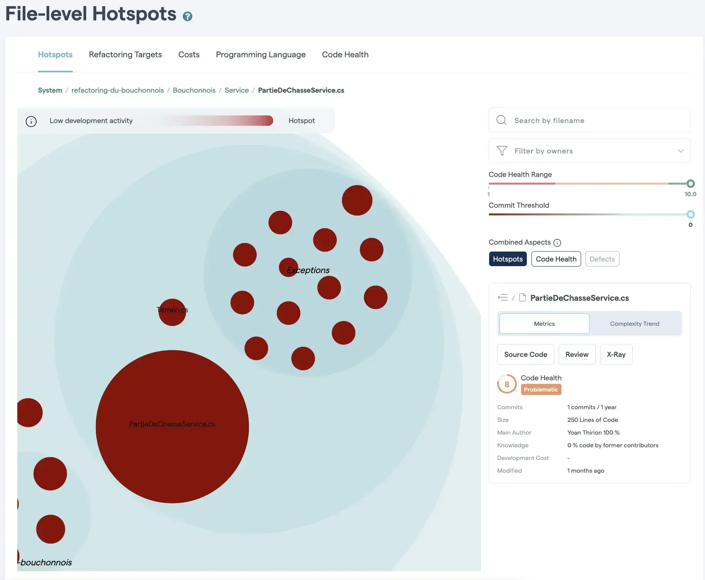
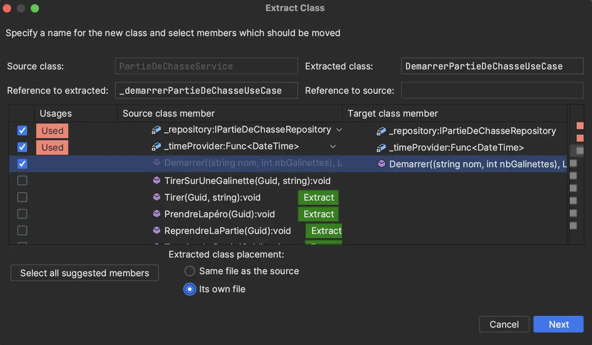

# Use Cases
Maintenant que nous sommes confiants vis-à-vis de nos tests nous allons pouvoir commencer à refactorer.
Nous pouvons démarrer en `splittant` notre principal hostpot : `PartieDeChasseService`.



Pour ce faire, nous allons utiliser la stratégie `Divide and Conquer` :
- Prendre du temps pour comprendre ce qu'est la [`Clean Architecture`](https://xtrem-tdd.netlify.app/Flavours/clean-architecture)
  - Notamment la notion de `Use Case`
- Extraire 1 `Use Case` par méthode du `Service`
- Améliorer la définition de notre architecture via nos tests `Archunit`

## Extraire un premier Use Case
- Utiliser les fonctionnalités de notre `IDE` pour extraire la méthode `Démarrer`
  - `Refactor` -> `Extract` -> `Extract Class`
  - Penser à configurer l'extraction de la méthode en `Create delegating Wrapper`



- Voici le résultat :

```csharp
public class DemarrerPartieDeChasseUseCase
{
    private readonly IPartieDeChasseRepository _repository;
    private readonly Func<DateTime> _timeProvider;

    public DemarrerPartieDeChasseUseCase(IPartieDeChasseRepository repository, Func<DateTime> timeProvider)
    {
        _repository = repository;
        _timeProvider = timeProvider;
    }

    public Guid Demarrer((string nom, int nbGalinettes) terrainDeChasse, List<(string nom, int nbBalles)> chasseurs)
    {
        if (terrainDeChasse.nbGalinettes <= 0)
        {
            throw new ImpossibleDeDémarrerUnePartieSansGalinettes();
        }

        var partieDeChasse =
            new PartieDeChasse(Guid.NewGuid(),
                new Terrain(terrainDeChasse.nom)
                {
                    NbGalinettes = terrainDeChasse.nbGalinettes
                }
            );

        foreach (var chasseur in chasseurs)
        {
            if (chasseur.nbBalles == 0)
            {
                throw new ImpossibleDeDémarrerUnePartieAvecUnChasseurSansBalle();
            }

            partieDeChasse.Chasseurs.Add(new Chasseur(chasseur.nom)
            {
                BallesRestantes = chasseur.nbBalles
            });
        }

        if (partieDeChasse.Chasseurs.Count == 0)
        {
            throw new ImpossibleDeDémarrerUnePartieSansChasseur();
        }

        string chasseursToString = string.Join(
            ", ",
            partieDeChasse.Chasseurs.Select(c => c.Nom + $" ({c.BallesRestantes} balles)")
        );

        partieDeChasse.Events.Add(new Event(_timeProvider(),
            $"La partie de chasse commence à {partieDeChasse.Terrain.Nom} avec {chasseursToString}")
        );

        _repository.Save(partieDeChasse);

        return partieDeChasse.Id;
    }
}
```

- La classe `PartieDeChasseService` délègue maintenant les appels de la méthode `Démarrer` à notre `Use Case`
  - Ainsi, nous compilons et nos tests sont toujours au vert

```csharp
public Guid Demarrer((string nom, int nbGalinettes) terrainDeChasse, List<(string nom, int nbBalles)> chasseurs)
        => _demarrerPartieDeChasseUseCase.Demarrer(terrainDeChasse, chasseurs);
```

## Répliquer celà pour tous les Use Cases

## Reflect
- Quel est l'impact sur le design ? les tests ?
- En quoi pouvons nous parler ici de `Screaming Architecture` ?

