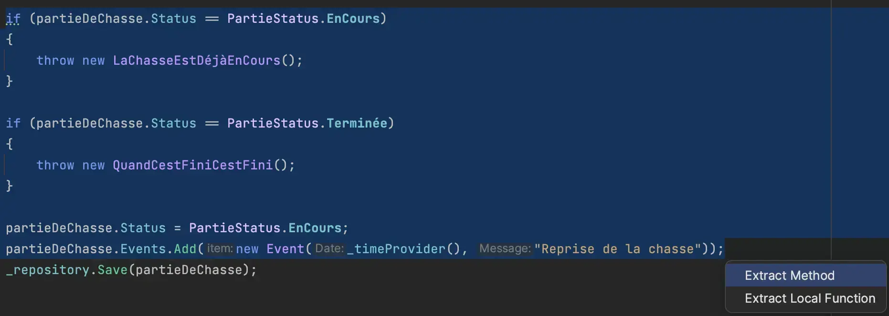
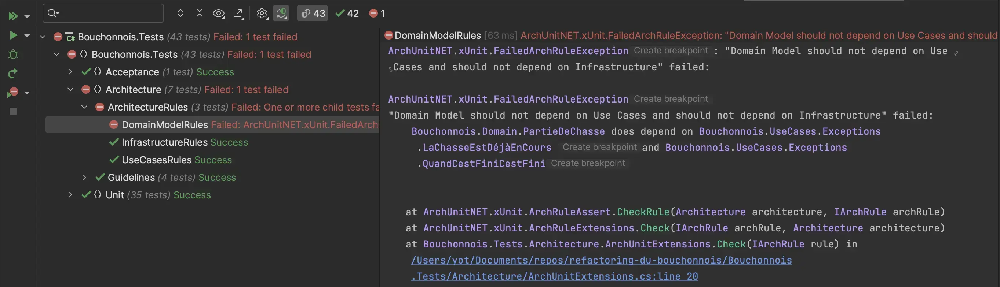
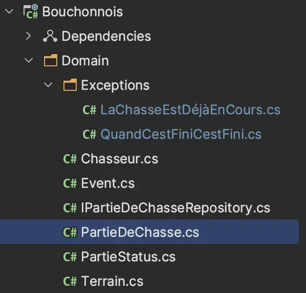

# Tell Don't Ask
Le code des `Use Cases` ressemble pour le moment furieusement à du code procédural en :
- interrogeant des objets
- prenant des décisions basées sur l'état de ces objets


Voici un exemple avec un `Use Case` existant :
```csharp
public sealed class ReprendreLaPartie
{
    private readonly IPartieDeChasseRepository _repository;
    private readonly Func<DateTime> _timeProvider;

    public ReprendreLaPartie(IPartieDeChasseRepository repository, Func<DateTime> timeProvider)
    {
        _repository = repository;
        _timeProvider = timeProvider;
    }

    public void Handle(Guid id)
    {
        var partieDeChasse = _repository.GetById(id);

        // Prise de décision
        if (partieDeChasse == null)
        {
            throw new LaPartieDeChasseNexistePas();
        }

        // Prise de décision
        if (partieDeChasse.Status == PartieStatus.EnCours)
        {
            throw new LaChasseEstDéjàEnCours();
        }

        // Prise de décision
        if (partieDeChasse.Status == PartieStatus.Terminée)
        {
            throw new QuandCestFiniCestFini();
        }

        // Changement d'état pas encapsulé
        partieDeChasse.Status = PartieStatus.EnCours;
        partieDeChasse.Events.Add(new Event(_timeProvider(), "Reprise de la chasse"));
        
        _repository.Save(partieDeChasse);
    }
}
```

Nous allons encapsuler la prise de décision au niveau du `Domain` et faire en sorte que les `Use Cases` respectent le principe `Tell Don't Ask` :
- Prendre du temps pour comprendre ce qu'est le principe [`Tell Don't Ask`](https://xtrem-tdd.netlify.app/Flavours/tell-dont-ask)
- Encapsuler le code `Business` des `Use Cases` dans le `Domain`
- Revoir l'encapsulation des objets afin de préserver l'état du `Domain`
  - Rendre impossible de représenter un état invalide

## Refactorer le Use Case : `ReprendreLaPartie`
- On commence par extraire le contenu business du `Use Case`
  - `Refactor` -> `Extract` -> `Extract Method`



```csharp
public sealed class ReprendreLaPartie
{
    ...
    public void Handle(Guid id)
    {
        var partieDeChasse = _repository.GetById(id);

        if (partieDeChasse == null)
        {
            throw new LaPartieDeChasseNexistePas();
        }

        Reprendre(partieDeChasse);
        _repository.Save(partieDeChasse);
    }

    private void Reprendre(PartieDeChasse partieDeChasse)
    {
        if (partieDeChasse.Status == PartieStatus.EnCours)
        {
            throw new LaChasseEstDéjàEnCours();
        }

        if (partieDeChasse.Status == PartieStatus.Terminée)
        {
            throw new QuandCestFiniCestFini();
        }

        partieDeChasse.Status = PartieStatus.EnCours;
        // passer en paramètre le timeprovider
        partieDeChasse.Events.Add(new Event(_timeProvider(), "Reprise de la chasse"));
    }
}
```

- Nous devons passer la fonction `_timeProvider` en paramètre de la méthode

```csharp
private void Reprendre(Func<DateTime> timeProvider, PartieDeChasse partieDeChasse)
{
    if (partieDeChasse.Status == PartieStatus.EnCours)
    {
        throw new LaChasseEstDéjàEnCours();
    }

    if (partieDeChasse.Status == PartieStatus.Terminée)
    {
        throw new QuandCestFiniCestFini();
    }

    partieDeChasse.Status = PartieStatus.EnCours;
    partieDeChasse.Events.Add(new Event(timeProvider(), "Reprise de la chasse"));
}
```

- Nous pouvons maintenant déplacer la méthode dans la classe `PartieDeChasse`
  - `Refactor` -> `Move`

```csharp
public sealed class PartieDeChasse
{
    ...
    public void Reprendre(Func<DateTime> timeProvider)
    {
        if (this.Status == PartieStatus.EnCours)
        {
            throw new LaChasseEstDéjàEnCours();
        }

        if (this.Status == PartieStatus.Terminée)
        {
            throw new QuandCestFiniCestFini();
        }

        this.Status = PartieStatus.EnCours;
        this.Events.Add(new Event(timeProvider(), "Reprise de la chasse"));
    }
}
```

- En déplaçant cette méthode dans le `Domain`, un test d'Architecture échoue :
  - Les exceptions lancées ne sont effectivement pas au sein du Domain 



- Nous devons déplacer ces exceptions `métiers` au sein du `Domain`



## Refactorer le `Domain`
Après avoir effectué ce refactoring pour chaque `Use Case`, nous pouvons améliorer l'encapsulation et l'implémentation de la classe `PartieDeChasseService`

Nouveau rapport `SonarCloud` disponible [ici](https://sonarcloud.io/summary/overall?id=ythirion_refactoring-du-bouchonnois&branch=steps%2F09-tell-dont-ask).

## Reflect
- Quel impact ce refactoring a eu sur les tests ?
- Qu'est-ce qui est plus simple / compliqué maintenant ?

