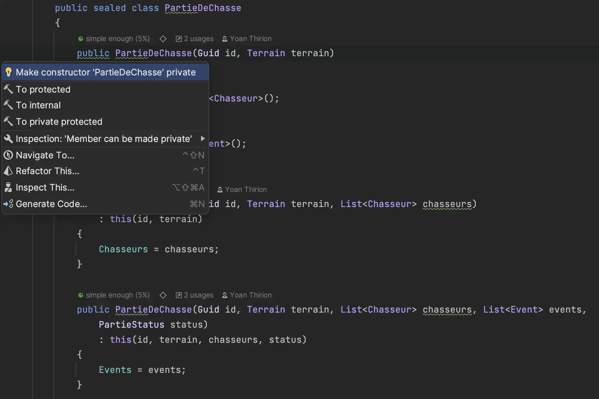

# Tell Don't Ask
Le code des `Use Cases` ressemble pour le moment furieusement à du code procédural en :
- interrogeant des objets
- prenant des décisions basées sur l'état de ces objets


Voici un exemple avec un `Use Case` existant :
```csharp
public sealed class ReprendreLaPartie
{
    private readonly IPartieDeChasseRepository _repository;
    private readonly Func<DateTime> _timeProvider;

    public ReprendreLaPartie(IPartieDeChasseRepository repository, Func<DateTime> timeProvider)
    {
        _repository = repository;
        _timeProvider = timeProvider;
    }

    public void Handle(Guid id)
    {
        var partieDeChasse = _repository.GetById(id);

        // Prise de décision
        if (partieDeChasse == null)
        {
            throw new LaPartieDeChasseNexistePas();
        }

        // Prise de décision
        if (partieDeChasse.Status == PartieStatus.EnCours)
        {
            throw new LaChasseEstDéjàEnCours();
        }

        // Prise de décision
        if (partieDeChasse.Status == PartieStatus.Terminée)
        {
            throw new QuandCestFiniCestFini();
        }

        // Changement d'état pas encapsulé
        partieDeChasse.Status = PartieStatus.EnCours;
        partieDeChasse.Events.Add(new Event(_timeProvider(), "Reprise de la chasse"));
        
        _repository.Save(partieDeChasse);
    }
}
```

Nous allons encapsuler la prise de décision au niveau du `Domain` et faire en sorte que les `Use Cases` respectent le principe `Tell Don't Ask` :
- Prendre du temps pour comprendre ce qu'est le principe [`Tell Don't Ask`](https://xtrem-tdd.netlify.app/Flavours/tell-dont-ask)
- Encapsuler le code `Business` des `Use Cases` dans le `Domain`
- Revoir l'encapsulation des objets afin de préserver l'état du `Domain`
  - Rendre impossible de représenter un état invalide
  - Avoir des objets métiers porteurs de sens

## Refactorer le Use Case : `ReprendreLaPartie`
- On commence par extraire le contenu business du `Use Case`
  - `Refactor` -> `Extract` -> `Extract Method`


```csharp
public sealed class ReprendreLaPartie
{
    ...
    public void Handle(Guid id)
    {
        var partieDeChasse = _repository.GetById(id);

        if (partieDeChasse == null)
        {
            throw new LaPartieDeChasseNexistePas();
        }

        Reprendre(partieDeChasse);
        _repository.Save(partieDeChasse);
    }

    private void Reprendre(PartieDeChasse partieDeChasse)
    {
        if (partieDeChasse.Status == PartieStatus.EnCours)
        {
            throw new LaChasseEstDéjàEnCours();
        }

        if (partieDeChasse.Status == PartieStatus.Terminée)
        {
            throw new QuandCestFiniCestFini();
        }

        partieDeChasse.Status = PartieStatus.EnCours;
        // passer en paramètre le timeprovider
        partieDeChasse.Events.Add(new Event(_timeProvider(), "Reprise de la chasse"));
    }
}
```

- Nous devons passer la fonction `_timeProvider` en paramètre de la méthode

```csharp
private void Reprendre(Func<DateTime> timeProvider, PartieDeChasse partieDeChasse)
{
    if (partieDeChasse.Status == PartieStatus.EnCours)
    {
        throw new LaChasseEstDéjàEnCours();
    }

    if (partieDeChasse.Status == PartieStatus.Terminée)
    {
        throw new QuandCestFiniCestFini();
    }

    partieDeChasse.Status = PartieStatus.EnCours;
    partieDeChasse.Events.Add(new Event(timeProvider(), "Reprise de la chasse"));
}
```

- Nous pouvons maintenant déplacer la méthode dans la classe `PartieDeChasse`
  - `Refactor` -> `Move`

```csharp
public sealed class PartieDeChasse
{
    ...
    public void Reprendre(Func<DateTime> timeProvider)
    {
        if (this.Status == PartieStatus.EnCours)
        {
            throw new LaChasseEstDéjàEnCours();
        }

        if (this.Status == PartieStatus.Terminée)
        {
            throw new QuandCestFiniCestFini();
        }

        this.Status = PartieStatus.EnCours;
        this.Events.Add(new Event(timeProvider(), "Reprise de la chasse"));
    }
}
```

- En déplaçant cette méthode dans le `Domain`, un test d'Architecture échoue :
  - Les exceptions lancées ne sont effectivement pas au sein du Domain 


- Nous devons déplacer ces exceptions `métiers` au sein du `Domain`


## Découvertes
- On continue ce refactoring pour chaque `Use Case` et faisons quelques "découvertes" :
  - 1 vérification manquante

```csharp
public sealed class TerminerLaPartie
{
    private readonly IPartieDeChasseRepository _repository;
    private readonly Func<DateTime> _timeProvider;

    public TerminerLaPartie(IPartieDeChasseRepository repository, Func<DateTime> timeProvider)
    {
        _repository = repository;
        _timeProvider = timeProvider;
    }

    public string Handle(Guid id)
    {
        // TODO : missing null check here
        var partieDeChasse = _repository.GetById(id);
        var result = partieDeChasse.Terminer(_timeProvider);

        _repository.Save(partieDeChasse);

        return result;
    }
}
```

- De la duplication de code dans chaque `Use Case` :

```csharp
public void Handle(Guid id)
{
    // Retrieve aggregate from repository
    var partieDeChasse = _repository.GetById(id);

    // Check if exists
    if (partieDeChasse == null)
    {
        throw new LaPartieDeChasseNexistePas();
    }

    // Call domain method
    ...
    
    // Save new state
    _repository.Save(partieDeChasse);
}
```

- Les méthodes `Tirer` et `TirerSurUneGalinette` contiennent du code dupliqué
  - Les appels au `Save` du repository se font dès qu'on ajoute un événement dans la liste d'events (même si une exception est lancée)

```csharp
public void Tirer(string chasseur, Func<DateTime> timeProvider,
            IPartieDeChasseRepository repository)
{
    if (this.Status != PartieStatus.Apéro)
    {
        if (this.Status != PartieStatus.Terminée)
        {
            if (this.Chasseurs.Exists(c => c.Nom == chasseur))
            {
                var chasseurQuiTire = this.Chasseurs.Find(c => c.Nom == chasseur)!;

                if (chasseurQuiTire.BallesRestantes == 0)
                {
                    this.Events.Add(new Event(timeProvider(),
                        $"{chasseur} tire -> T'as plus de balles mon vieux, chasse à la main"));
                    repository.Save(this);

                    throw new TasPlusDeBallesMonVieuxChasseALaMain();
                }

                this.Events.Add(new Event(timeProvider(), $"{chasseur} tire"));
                chasseurQuiTire.BallesRestantes--;
            }
            else
            {
                throw new ChasseurInconnu(chasseur);
            }
        }
        else
        {
            this.Events.Add(new Event(timeProvider(),
                $"{chasseur} veut tirer -> On tire pas quand la partie est terminée"));
            repository.Save(this);

            throw new OnTirePasQuandLaPartieEstTerminée();
        }
    }
    else
    {
        this.Events.Add(new Event(timeProvider(),
            $"{chasseur} veut tirer -> On tire pas pendant l'apéro, c'est sacré !!!"));
        repository.Save(this);

        throw new OnTirePasPendantLapéroCestSacré();
    }
}

public void TirerSurUneGalinette(string chasseur,
    Func<DateTime> timeProvider,
    IPartieDeChasseRepository repository)
{
    if (this.Terrain.NbGalinettes != 0)
    {
        if (this.Status != PartieStatus.Apéro)
        {
            if (this.Status != PartieStatus.Terminée)
            {
                if (this.Chasseurs.Exists(c => c.Nom == chasseur))
                {
                    var chasseurQuiTire = this.Chasseurs.Find(c => c.Nom == chasseur)!;

                    if (chasseurQuiTire.BallesRestantes == 0)
                    {
                        this.Events.Add(new Event(timeProvider(),
                            $"{chasseur} veut tirer sur une galinette -> T'as plus de balles mon vieux, chasse à la main"));
                        repository.Save(this);

                        throw new TasPlusDeBallesMonVieuxChasseALaMain();
                    }

                    chasseurQuiTire.BallesRestantes--;
                    chasseurQuiTire.NbGalinettes++;
                    this.Terrain.NbGalinettes--;
                    this.Events.Add(new Event(timeProvider(), $"{chasseur} tire sur une galinette"));
                }
                else
                {
                    throw new ChasseurInconnu(chasseur);
                }
            }
            else
            {
                this.Events.Add(new Event(timeProvider(),
                    $"{chasseur} veut tirer -> On tire pas quand la partie est terminée"));
                repository.Save(this);

                throw new OnTirePasQuandLaPartieEstTerminée();
            }
        }
        else
        {
            this.Events.Add(new Event(timeProvider(),
                $"{chasseur} veut tirer -> On tire pas pendant l'apéro, c'est sacré !!!"));
            repository.Save(this);
            throw new OnTirePasPendantLapéroCestSacré();
        }
    }
    else
    {
        throw new TasTropPicoléMonVieuxTasRienTouché();
    }
}
```

## Refactorer le `Domain`
- Après les différents refactorings voici l'état de la classe `PartieDeChasse` :

```csharp
using Bouchonnois.Domain.Exceptions;
using static System.String;
using static Bouchonnois.Domain.PartieStatus;

namespace Bouchonnois.Domain
{
    public sealed class PartieDeChasse
    {
        public PartieDeChasse(Guid id, Terrain terrain)
        {
            Id = id;
            Chasseurs = new List<Chasseur>();
            Terrain = terrain;
            Status = EnCours;
            Events = new List<Event>();
        }

        public PartieDeChasse(Guid id, Terrain terrain, List<Chasseur> chasseurs)
            : this(id, terrain)
        {
            Chasseurs = chasseurs;
        }

        public PartieDeChasse(Guid id, Terrain terrain, List<Chasseur> chasseurs, List<Event> events,
            PartieStatus status)
            : this(id, terrain, chasseurs, status)
        {
            Events = events;
        }

        public PartieDeChasse(Guid id, Terrain terrain, List<Chasseur> chasseurs, PartieStatus status)
            : this(id, terrain, chasseurs)
        {
            Status = status;
        }


        public Guid Id { get; }
        public List<Chasseur> Chasseurs { get; }
        public Terrain Terrain { get; }
        public PartieStatus Status { get; set; }
        public List<Event> Events { get; init; }

        public static PartieDeChasse CreatePartieDeChasse(
            Func<DateTime> timeProvider,
            (string nom, int nbGalinettes) terrainDeChasse,
            List<(string nom, int nbBalles)> chasseurs)
        {
            if (terrainDeChasse.nbGalinettes <= 0)
            {
                throw new ImpossibleDeDémarrerUnePartieSansGalinettes();
            }

            var partieDeChasse =
                new PartieDeChasse(Guid.NewGuid(),
                    new Terrain(terrainDeChasse.nom)
                    {
                        NbGalinettes = terrainDeChasse.nbGalinettes
                    }
                );

            foreach (var chasseur in chasseurs)
            {
                if (chasseur.nbBalles == 0)
                {
                    throw new ImpossibleDeDémarrerUnePartieAvecUnChasseurSansBalle();
                }

                partieDeChasse.Chasseurs.Add(new Chasseur(chasseur.nom)
                {
                    BallesRestantes = chasseur.nbBalles
                });
            }

            if (partieDeChasse.Chasseurs.Count == 0)
            {
                throw new ImpossibleDeDémarrerUnePartieSansChasseur();
            }

            string chasseursToString = string.Join(
                ", ",
                partieDeChasse.Chasseurs.Select(c => c.Nom + $" ({c.BallesRestantes} balles)")
            );

            partieDeChasse.Events.Add(new Event(timeProvider(),
                $"La partie de chasse commence à {partieDeChasse.Terrain.Nom} avec {chasseursToString}")
            );
            return partieDeChasse;
        }

        public void PrendreLapéro(Func<DateTime> timeProvider)
        {
            if (Status == PartieStatus.Apéro)
            {
                throw new OnEstDéjàEnTrainDePrendreLapéro();
            }
            else if (Status == PartieStatus.Terminée)
            {
                throw new OnPrendPasLapéroQuandLaPartieEstTerminée();
            }

            Status = PartieStatus.Apéro;
            Events.Add(new Event(timeProvider(), "Petit apéro"));
        }

        public void Reprendre(Func<DateTime> timeProvider)
        {
            if (Status == EnCours)
            {
                throw new LaChasseEstDéjàEnCours();
            }

            if (Status == Terminée)
            {
                throw new QuandCestFiniCestFini();
            }

            Status = EnCours;
            Events.Add(new Event(timeProvider(), "Reprise de la chasse"));
        }

        public string Consulter() =>
            Join(
                Environment.NewLine,
                Events
                    .OrderByDescending(@event => @event.Date)
                    .Select(@event => @event.ToString())
            );

        public string Terminer(Func<DateTime> timeProvider)
        {
            var classement = this
                .Chasseurs
                .GroupBy(c => c.NbGalinettes)
                .OrderByDescending(g => g.Key);

            if (this.Status == PartieStatus.Terminée)
            {
                throw new QuandCestFiniCestFini();
            }

            this.Status = PartieStatus.Terminée;

            string result;

            if (classement.All(group => group.Key == 0))
            {
                result = "Brocouille";
                this.Events.Add(
                    new Event(timeProvider(), "La partie de chasse est terminée, vainqueur : Brocouille")
                );
            }
            else
            {
                result = string.Join(", ", classement.ElementAt(0).Select(c => c.Nom));
                this.Events.Add(
                    new Event(timeProvider(),
                        $"La partie de chasse est terminée, vainqueur : {string.Join(", ", classement.ElementAt(0).Select(c => $"{c.Nom} - {c.NbGalinettes} galinettes"))}"
                    )
                );
            }

            return result;
        }

        public void Tirer(string chasseur, Func<DateTime> timeProvider,
            IPartieDeChasseRepository repository)
        {
            if (this.Status != PartieStatus.Apéro)
            {
                if (this.Status != PartieStatus.Terminée)
                {
                    if (this.Chasseurs.Exists(c => c.Nom == chasseur))
                    {
                        var chasseurQuiTire = this.Chasseurs.Find(c => c.Nom == chasseur)!;

                        if (chasseurQuiTire.BallesRestantes == 0)
                        {
                            this.Events.Add(new Event(timeProvider(),
                                $"{chasseur} tire -> T'as plus de balles mon vieux, chasse à la main"));
                            repository.Save(this);

                            throw new TasPlusDeBallesMonVieuxChasseALaMain();
                        }

                        this.Events.Add(new Event(timeProvider(), $"{chasseur} tire"));
                        chasseurQuiTire.BallesRestantes--;
                    }
                    else
                    {
                        throw new ChasseurInconnu(chasseur);
                    }
                }
                else
                {
                    this.Events.Add(new Event(timeProvider(),
                        $"{chasseur} veut tirer -> On tire pas quand la partie est terminée"));
                    repository.Save(this);

                    throw new OnTirePasQuandLaPartieEstTerminée();
                }
            }
            else
            {
                this.Events.Add(new Event(timeProvider(),
                    $"{chasseur} veut tirer -> On tire pas pendant l'apéro, c'est sacré !!!"));
                repository.Save(this);

                throw new OnTirePasPendantLapéroCestSacré();
            }
        }

        public void TirerSurUneGalinette(string chasseur,
            Func<DateTime> timeProvider,
            IPartieDeChasseRepository repository)
        {
            if (this.Terrain.NbGalinettes != 0)
            {
                if (this.Status != PartieStatus.Apéro)
                {
                    if (this.Status != PartieStatus.Terminée)
                    {
                        if (this.Chasseurs.Exists(c => c.Nom == chasseur))
                        {
                            var chasseurQuiTire = this.Chasseurs.Find(c => c.Nom == chasseur)!;

                            if (chasseurQuiTire.BallesRestantes == 0)
                            {
                                this.Events.Add(new Event(timeProvider(),
                                    $"{chasseur} veut tirer sur une galinette -> T'as plus de balles mon vieux, chasse à la main"));
                                repository.Save(this);

                                throw new TasPlusDeBallesMonVieuxChasseALaMain();
                            }

                            chasseurQuiTire.BallesRestantes--;
                            chasseurQuiTire.NbGalinettes++;
                            this.Terrain.NbGalinettes--;
                            this.Events.Add(new Event(timeProvider(), $"{chasseur} tire sur une galinette"));
                        }
                        else
                        {
                            throw new ChasseurInconnu(chasseur);
                        }
                    }
                    else
                    {
                        this.Events.Add(new Event(timeProvider(),
                            $"{chasseur} veut tirer -> On tire pas quand la partie est terminée"));
                        repository.Save(this);

                        throw new OnTirePasQuandLaPartieEstTerminée();
                    }
                }
                else
                {
                    this.Events.Add(new Event(timeProvider(),
                        $"{chasseur} veut tirer -> On tire pas pendant l'apéro, c'est sacré !!!"));
                    repository.Save(this);
                    throw new OnTirePasPendantLapéroCestSacré();
                }
            }
            else
            {
                throw new TasTropPicoléMonVieuxTasRienTouché();
            }
        }
    }
}
```

- Nous sommes couverts par les tests, nous allons pouvoir nous amuser en terme de refactoring 😊
  - On commence par le feedback fourni par notre IDE sur les constructeurs :



- Nous n'avons plus qu'un seul constructeur `public` :
```csharp
public sealed class PartieDeChasse
{
    private PartieDeChasse(Guid id, Terrain terrain)
    {
        Id = id;
        Chasseurs = new List<Chasseur>();
        Terrain = terrain;
        Status = EnCours;
        Events = new List<Event>();
    }

    private PartieDeChasse(Guid id, Terrain terrain, List<Chasseur> chasseurs)
        : this(id, terrain)
    {
        Chasseurs = chasseurs;
    }

    private PartieDeChasse(Guid id, Terrain terrain, List<Chasseur> chasseurs, PartieStatus status)
        : this(id, terrain, chasseurs)
    {
        Status = status;
    }

    public PartieDeChasse(Guid id, Terrain terrain, List<Chasseur> chasseurs, List<Event> events,
        PartieStatus status)
        : this(id, terrain, chasseurs, status)
    {
        Events = events;
    }
    ...
} 
```

- Le constructeur est appelé par notre `Test Data Builder` :

```csharp
public PartieDeChasse Build() => new(
    Guid.NewGuid(),
    new Terrain("Pitibon sur Sauldre") {NbGalinettes = _nbGalinettes},
    _chasseurs.Select(c => c.Build()).ToList(),
    _events.ToList(),
    _status
);
```

- Nous voulons forcer l'instantiation de cette classe par sa factory
  - Nous allons donc faire appel à la `Factory Method` plutôt qu'à 1 constructeur


Nouveau rapport `SonarCloud` disponible [ici](https://sonarcloud.io/summary/overall?id=ythirion_refactoring-du-bouchonnois&branch=steps%2F09-tell-dont-ask).

## Reflect
- Quel impact ce refactoring a eu sur les tests ?
- Qu'est-ce qui est plus simple / compliqué maintenant ?

