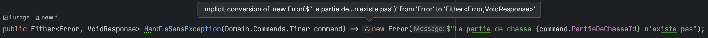

# "Avoid Exceptions"
`Quel est le problème avec ce code ?`

```csharp
tirerUseCase.Handle(new Domain.Commands.Tirer(id, Data.Bernard));

public TResponse Handle(TRequest command)
{
    var partieDeChasse = _repository.GetById(command.PartieDeChasseId);

    if (partieDeChasse == null)
    {
        throw new LaPartieDeChasseNexistePas();
    }

    var response = _handler(partieDeChasse, command);
    _repository.Save(partieDeChasse);

    return response;
}
```

Si on regarde la signature de la méthode `Handle` : 
- `TRequest` -> `TResponse`
  - Que l'on peut traduire par : `Pour tout TRequest je te retourne 1 TResponse`
  - Ce qui est faux puisque cette méthode et la méthode d'handling peuvent lancer des exceptions
- La signature de cette méthode ne représente pas de manière explicite les sorties possibles de cette dernière

Souvent notre code contient ce genre de `mensonges`... 


Pour aller plus loin sur ce sujet je t'invite à regarder la super conférence de [Scott Wlaschin](https://www.linkedin.com/in/scottwlaschin/) sur le sujet : [Functional Design Patterns](https://youtu.be/srQt1NAHYC0).

Nous allons chercher à rendre ce code plus explicite en :
- Évitant l'utilisation à outrance des `Exception`
  - Elles sont beaucoup trop utilisés pour représenter des cas d'erreurs business sous contrôles
- Les remplaçant par des retours de type `Error`
- Utilisant les fameuses `Monads`

## Comment ?
- Prendre du temps pour lire ces pages :
  - [Avoid Exceptions](https://xtrem-tdd.netlify.app/Flavours/avoid-exceptions)
  - [Monads](https://xtrem-tdd.netlify.app/Flavours/monads)
- À l'aide de `T.D.D` et du `Strangler` pattern, refactorer le `Use Case` `Tirer` afin que la signature de `Handle` ressemble à :
  - `TRequest` -> `Either<Error, TResponse>`
  - soit `Commands.Tirer` -> `Either<Error, VoidResponse>`
    - On limitera le type `Error` à 1 message décrivant l'erreur qui s'est produite

## Le `Use Case` : `Tirer`
Pour implémenter notre méthode nous allons repartir de la `Test List` actuelle :
```text
Échoue car :
- La partie n'existe pas
- Le chasseur n'a plus de balle
- Le chasseur n'est pas dans la partie
- Les chasseurs sont à l'apéro
- La partie de chasse est terminée

Réussi pour :
- Un chassseur présent dans la partie et lui restant des balles
```

:red_circle: On commence par écrire 1 test qui échoue dans la classe de test existante

- On y décrit nos attentes vis-à vis de la future méthode

```csharp
[Fact]
public void CarPartieNexistePasSansException()
{
    // TODO extract to Given When Then methods
    
    // Arrange
    var partieDeChasseId = UnePartieDeChasseInexistante();
    
    // Act
    var result = _useCase.HandleSansException(new Domain.Commands.Tirer(partieDeChasseId, Data.Bernard));
    
    // Assert
    result.Should().BeLeft(); // Par convention Left contient le cas d'erreur
    result.Left().Should().Be($"La partie de chasse {partieDeChasseId} n'existe pas");
    SavedPartieDeChasse().Should().BeNull();
}
```

- On ne compile pas et donc le test échoue


- On génère depuis le test le code de la méthode ``

```csharp
public Either<Error, VoidResponse> HandleSansException(Domain.Commands.Tirer command) => throw new NotImplementedException();
```

- On ajoute les références nous permettant d'utiliser des monades existantes : [`LanguageExt`](https://github.com/louthy/language-ext)

```shell
dotnet add package "LanguageExt.Core"
dotnet add package "FluentAssertions.LanguageExt"
```

- On doit maintenant générer la classe `Error`


```csharp
public record Error(string Message);
```

- On "fixe" les assertions du test pour pouvoir compiler

```csharp
[Fact]
public void CarPartieNexistePasSansException()
{
    // TODO extract to Given When Then methods

    // Arrange
    var partieDeChasseId = UnePartieDeChasseInexistante();

    // Act
    var result = _useCase.HandleSansException(new Domain.Commands.Tirer(partieDeChasseId, Data.Bernard));

    // Assert
    result.Should().BeLeft(); // Par convention Left contient le cas d'erreur
    result.IfLeft(error =>
    {
        error.Message.Should().Be($"La partie de chasse {partieDeChasseId} n'existe pas");
        SavedPartieDeChasse().Should().BeNull();
    });
}
```

- On est maintenant au `rouge` pour une bonne raison


:green_circle: On fait passer le test au vert le plus rapidement possible

```csharp
public Either<Error, VoidResponse> HandleSansException(Domain.Commands.Tirer command) => new Error($"La partie de chasse {command.PartieDeChasseId} n'existe pas");
```

- Ici on peut retourner directement 1 `Error` grâce à l'import de `namespace` ci-dessous et l'implicit conversion :

```csharp
using static LanguageExt.Prelude;
```



:large_blue_circle: Qu'est-ce qui peut être amélioré ici ?

- Peut-être, faire une [`Factory Method`](https://xtrem-tdd.netlify.app/Flavours/factory-pattern) pour l'instanciation des `Error`

```csharp
public Either<Error, VoidResponse> HandleSansException(Domain.Commands.Tirer command) => AnError($"La partie de chasse {command.PartieDeChasseId} n'existe pas");

public record Error
{
    public string Message { get; }
    private Error(string message) => Message = message;
    public static Error AnError(string message) => new(message);
}
```

- On peut également refactorer le test afin que ce dernier respecte la structure `Given / When / Then`
  - On peut isoler les méthodes actuelles dans une classe `partial`
  - On sait qu'à terme elle pourra être supprimée...


- On décrit ce qu'on voudrait dans le `Given / When / Then` et l'extrait puis "générifie" le tout

```csharp
public class Tirer : UseCaseTestWithoutException<UseCases.Tirer, VoidResponse>
{
    ...

    public class Echoue : UseCaseTestWithoutException<UseCases.Tirer, VoidResponse>
    {
        ...
        
        [Fact]
        public void CarPartieNexistePasSansException()
        {
            Given(UnePartieDeChasseInexistante());

            When(partieDeChasseId =>
                _useCase.HandleSansException(new Domain.Commands.Tirer(partieDeChasseId, Data.Bernard)));

            ThenFailWith(
                $"La partie de chasse {_partieDeChasseId} n'existe pas",
                savedPartieDeChasse => savedPartieDeChasse.Should().BeNull()
            );
        }
    ...
}

public abstract class UseCaseTestWithoutException<TUseCase, TSuccessResponse> : UseCaseTest<TUseCase>
{
    protected UseCaseTestWithoutException(Func<IPartieDeChasseRepository, Func<DateTime>, TUseCase> useCaseFactory)
        : base(useCaseFactory)
    {
    }

    private Func<Guid, Either<Error, TSuccessResponse>>? _act;
    protected void When(Func<Guid, Either<Error, TSuccessResponse>>? act) => _act = act;

    protected void ThenFailWith(string expectedErrorMessage, Action<PartieDeChasse?>? assertSavedPartieDeChasse)
    {
        var result = _act!(_partieDeChasseId);
        result.Should().BeLeft();
        result.IfLeft(r =>
        {
            r.Message.Should().Be(expectedErrorMessage);
            assertSavedPartieDeChasse?.Invoke(SavedPartieDeChasse());
        });
    }
}
```

Voici où on en est :

```text
Échoue car :
✅ La partie n'existe pas
- Le chasseur n'est pas dans la partie
- Le chasseur n'a plus de balle
- Les chasseurs sont à l'apéro
- La partie de chasse est terminée

Réussi pour :
- Un chassseur présent dans la partie et lui restant des balles
```

### Le chasseur n'est pas dans la partie
:red_circle: On modifie le test existant

```csharp
[Fact]
public void CarLeChasseurNestPasDansLaPartie()
{
    Given(
        UnePartieDeChasseExistante(
            SurUnTerrainRicheEnGalinettes()
        ));

    When(id => _useCase.HandleSansException(new Domain.Commands.Tirer(id, Data.ChasseurInconnu)));

    ThenFailWith("Chasseur inconnu Chasseur inconnu",
        savedPartieDeChasse => savedPartieDeChasse.Should().BeNull());
}
```

:green_circle: On doit adapter la méthode `HandleSansException` pour supporter cette fonctionnalité

```csharp
public Either<Error, VoidResponse> HandleSansException(Domain.Commands.Tirer command)
{
    if (_repository.GetById(command.PartieDeChasseId) == null)
    {
        return AnError($"La partie de chasse {command.PartieDeChasseId} n'existe pas");
    }

    return AnError($"Chasseur inconnu {command.Chasseur}");
}
```

:large_blue_circle: Appeler le code du `Domain`

```csharp
public Either<Error, VoidResponse> HandleSansException(Domain.Commands.Tirer command,
            Func<DateTime> timeProvider)
{
    var partieDeChasse = _repository.GetById(command.PartieDeChasseId);

    if (partieDeChasse == null)
        return AnError($"La partie de chasse {command.PartieDeChasseId} n'existe pas");

    try
    {
        partieDeChasse.Tirer(command.Chasseur, timeProvider, _repository);
    }
    catch (ChasseurInconnu)
    {
        return AnError($"Chasseur inconnu {command.Chasseur}");
    }

    return VoidResponse.Empty;
}
```

```text
Échoue car :
✅ La partie n'existe pas
✅ Le chasseur n'est pas dans la partie
- Le chasseur n'a plus de balle
- Les chasseurs sont à l'apéro
- La partie de chasse est terminée

Réussi pour :
- Un chassseur présent dans la partie et lui restant des balles
```

### Le chasseur n'a plus de balle
:red_circle: On modifie le test existant

```csharp
[Fact]
public void AvecUnChasseurNayantPlusDeBalles()
{
    Given(
        UnePartieDeChasseExistante(
            SurUnTerrainRicheEnGalinettes()
                .Avec(Dédé(), Bernard().SansBalles(), Robert())
        ));

    When(id => _useCase.HandleSansException(new Domain.Commands.Tirer(id, Data.Bernard)));

    ThenFailWith("Bernard tire -> T'as plus de balles mon vieux, chasse à la main",
        savedPartieDeChasse => savedPartieDeChasse.Should().HaveEmittedEvent(Now,
            $"Bernard tire -> T'as plus de balles mon vieux, chasse à la main")
    );
}
```

:green_circle: On adapte encore une fois la méthode `HandleSansException`

```csharp
public Either<Error, VoidResponse> HandleSansException(Domain.Commands.Tirer command)
{
    var partieDeChasse = _repository.GetById(command.PartieDeChasseId);

    if (partieDeChasse == null)
        return AnError($"La partie de chasse {command.PartieDeChasseId} n'existe pas");

    try
    {
        partieDeChasse.Tirer(command.Chasseur, _timeProvider, _repository);
    }
    catch (ChasseurInconnu)
    {
        return AnError($"Chasseur inconnu {command.Chasseur}");
    }
    catch (TasPlusDeBallesMonVieuxChasseALaMain)
    {
        return AnError($"{command.Chasseur} tire -> T'as plus de balles mon vieux, chasse à la main");
    }

    return VoidResponse.Empty;
}
```

:large_blue_circle: Cette logique d'exception devra disparaitre, il est donc temps de s'y attaquer.

- On va modifier la méthode du `Domain` pour qu'elle ressemble à celà :
  - `string` -> `Func<DateTime>` -> `IPartieDeChasseRepository` -> `Either<Error, PartieDeChasse>`
- Nous voulons quelque chose du genre dans le `Use Case` :

```csharp
public Either<Error, VoidResponse> HandleSansException(Domain.Commands.Tirer command)
{
    var partieDeChasse = _repository.GetById(command.PartieDeChasseId);

    if (partieDeChasse == null)
        return AnError($"La partie de chasse {command.PartieDeChasseId} n'existe pas");

    return partieDeChasse
        .TirerSansException(command.Chasseur, _timeProvider, _repository)
        .Map(_ => VoidResponse.Empty);
}
```

- On adapte le code de la `PartieDeChasse` afin de couvrir les besoins actuelles :

```csharp
public Either<Error, PartieDeChasse> TirerSansException(
    string chasseur,
    Func<DateTime> timeProvider,
    IPartieDeChasseRepository repository)
    => TirerSansException(chasseur,
        timeProvider,
        repository,
        debutMessageSiPlusDeBalles: $"{chasseur} tire");

// Le Domain renvoie directement l'erreur s'il y en a plutôt que de lancer des exceptions
private Either<Error, PartieDeChasse> TirerSansException(
    string chasseur,
    Func<DateTime> timeProvider,
    IPartieDeChasseRepository repository,
    string debutMessageSiPlusDeBalles,
    Action<Chasseur>? continueWith = null)
{
    if (DuringApéro())
    {
        EmitEventAndSave($"{chasseur} veut tirer -> On tire pas pendant l'apéro, c'est sacré !!!", timeProvider,
            repository);
        throw new OnTirePasPendantLapéroCestSacré();
    }

    if (DéjàTerminée())
    {
        EmitEventAndSave($"{chasseur} veut tirer -> On tire pas quand la partie est terminée", timeProvider,
            repository);
        throw new OnTirePasQuandLaPartieEstTerminée();
    }

    if (!ChasseurExiste(chasseur))
    {
        return AnError($"Chasseur inconnu {chasseur}");
    }

    var chasseurQuiTire = RetrieveChasseur(chasseur);

    if (!chasseurQuiTire.AEncoreDesBalles())
    {
        EmitEventAndSave($"{debutMessageSiPlusDeBalles} -> T'as plus de balles mon vieux, chasse à la main",
            timeProvider, repository);
        return AnError($"{debutMessageSiPlusDeBalles} -> T'as plus de balles mon vieux, chasse à la main");
    }

    chasseurQuiTire.ATiré();
    continueWith?.Invoke(chasseurQuiTire);

    EmitEvent($"{chasseur} tire", timeProvider);

    return this;
}
```

On a bien avancé :

```text
Échoue car :
✅ La partie n'existe pas
✅ Le chasseur n'est pas dans la partie
✅ Le chasseur n'a plus de balle
- Les chasseurs sont à l'apéro
- La partie de chasse est terminée

Réussi pour :
- Un chassseur présent dans la partie et lui restant des balles
```

### Finir la Test-List
- En finissant la `Test-List` nous avonc le code du `Use Case` qui ressemble à celà :


l'Aggregate ressemble à ça :

```csharp
public Either<Error, PartieDeChasse> TirerSansException(
    string chasseur,
    Func<DateTime> timeProvider,
    IPartieDeChasseRepository repository)
    => TirerSansException(chasseur,
        timeProvider,
        repository,
        debutMessageSiPlusDeBalles: $"{chasseur} tire");

private Either<Error, PartieDeChasse> TirerSansException(
    string chasseur,
    Func<DateTime> timeProvider,
    IPartieDeChasseRepository repository,
    string debutMessageSiPlusDeBalles,
    Action<Chasseur>? continueWith = null)
{
    if (DuringApéro())
    {
        EmitEventAndSave($"{chasseur} veut tirer -> On tire pas pendant l'apéro, c'est sacré !!!", timeProvider,
            repository);
        return AnError($"{chasseur} veut tirer -> On tire pas pendant l'apéro, c'est sacré !!!");
    }

    if (DéjàTerminée())
    {
        EmitEventAndSave($"{chasseur} veut tirer -> On tire pas quand la partie est terminée", timeProvider,
            repository);
        return AnError($"{chasseur} veut tirer -> On tire pas quand la partie est terminée");
    }

    if (!ChasseurExiste(chasseur))
    {
        return AnError($"Chasseur inconnu {chasseur}");
    }

    var chasseurQuiTire = RetrieveChasseur(chasseur);

    if (!chasseurQuiTire.AEncoreDesBalles())
    {
        EmitEventAndSave($"{debutMessageSiPlusDeBalles} -> T'as plus de balles mon vieux, chasse à la main",
            timeProvider, repository);
        return AnError($"{debutMessageSiPlusDeBalles} -> T'as plus de balles mon vieux, chasse à la main");
    }

    chasseurQuiTire.ATiré();
    continueWith?.Invoke(chasseurQuiTire);

    EmitEvent($"{chasseur} tire", timeProvider);

    return this;
}
```

- On a pas mal de duplication à supprimer
  - Chaque message est construit 2 fois -> pour l'event et l'erreur
  - De la même manière, avons-nous encore besoin d'appeler le `Save` du repository ?
    - Celui-ci était présent car les exceptions "coupaient" le flow...
    - Notre `Use Case` peut très bien le faire de manière systématique

:large_blue_circle: On extrait une nouvelle méthode

```csharp
private Either<Error, PartieDeChasse> TirerSansException(
    string chasseur,
    Func<DateTime> timeProvider,
    IPartieDeChasseRepository repository,
    string debutMessageSiPlusDeBalles,
    Action<Chasseur>? continueWith = null)
{
    if (DuringApéro())
    {
        var message = $"{chasseur} veut tirer -> On tire pas pendant l'apéro, c'est sacré !!!";
        return EmitAndReturn(timeProvider, repository, message);
    }
    ...
}

private Either<Error, PartieDeChasse> EmitAndReturn(Func<DateTime> timeProvider, IPartieDeChasseRepository repository, string message)
{
    EmitEventAndSave(message, timeProvider,
        repository);
    return AnError(message);
}
```

- On itère dessus, ainsi que sur le code du Use Case :

```csharp
private Either<Error, PartieDeChasse> TirerSansException(
    string chasseur,
    Func<DateTime> timeProvider,
    string debutMessageSiPlusDeBalles,
    Action<Chasseur>? continueWith = null)
{
    if (DuringApéro())
    {
        return EmitAndReturn(
            $"{chasseur} veut tirer -> On tire pas pendant l'apéro, c'est sacré !!!",
            timeProvider);
    }

    if (DéjàTerminée())
    {
        return EmitAndReturn($"{chasseur} veut tirer -> On tire pas quand la partie est terminée",
            timeProvider);
    }

    if (!ChasseurExiste(chasseur))
    {
        return EmitAndReturn($"Chasseur inconnu {chasseur}", timeProvider);
    }

    var chasseurQuiTire = RetrieveChasseur(chasseur);

    if (!chasseurQuiTire.AEncoreDesBalles())
    {
        return EmitAndReturn($"{debutMessageSiPlusDeBalles} -> T'as plus de balles mon vieux, chasse à la main",
            timeProvider);
    }

    chasseurQuiTire.ATiré();
    continueWith?.Invoke(chasseurQuiTire);

    EmitEvent($"{chasseur} tire", timeProvider);

    return this;
}

private Either<Error, PartieDeChasse> EmitAndReturn(string message, Func<DateTime> timeProvider)
{
    EmitEvent(message, timeProvider);
    return AnError(message);
}

// Use Case
public Either<Error, VoidResponse> HandleSansException(Domain.Commands.Tirer command)
{
    var partieDeChasse = _repository.GetById(command.PartieDeChasseId);

    if (partieDeChasse == null)
        return AnError($"La partie de chasse {command.PartieDeChasseId} n'existe pas");

    var result = partieDeChasse
        .TirerSansException(command.Chasseur, _timeProvider)
        .Map(_ => VoidResponse.Empty);

    // On force le Save de la Partie de Chasse quelque soit le retour (Succès ou pas)
    _repository.Save(partieDeChasse);

    return result;
}
```


## Reflect
- Qu'est-ce que vous pensez des `Monads` ?
- Quel est leur impact sur notre code ?
- Quel impact ce refactoring a eu ?

