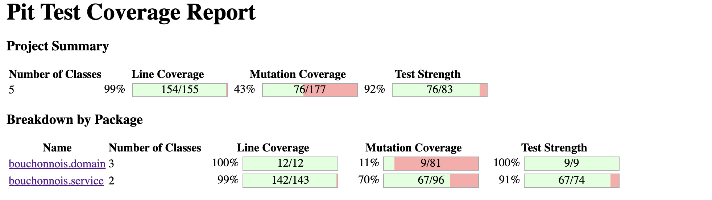
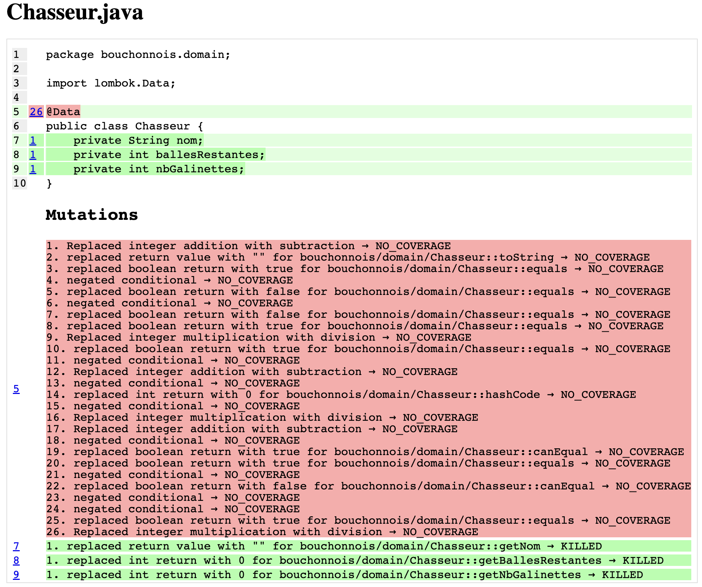
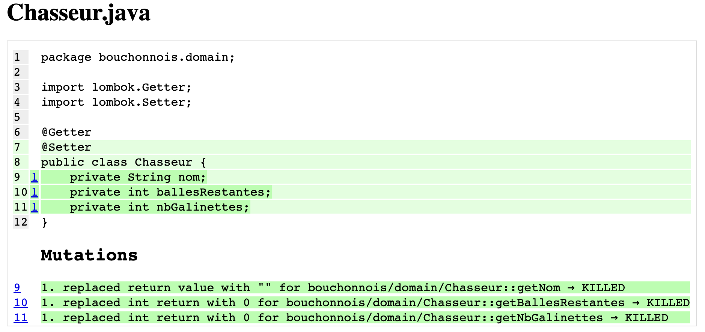
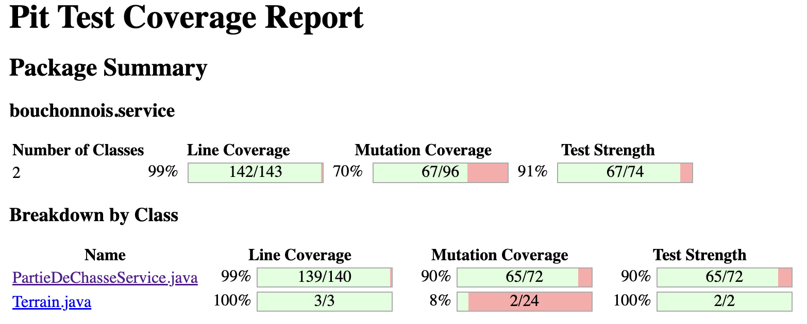
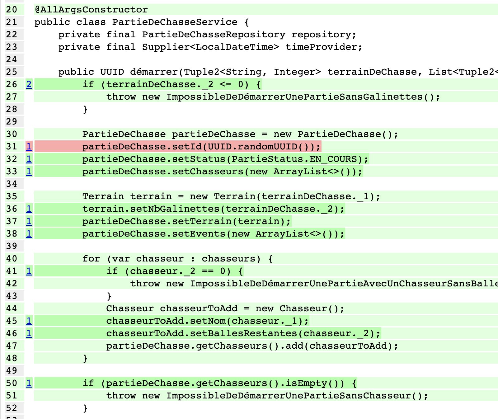
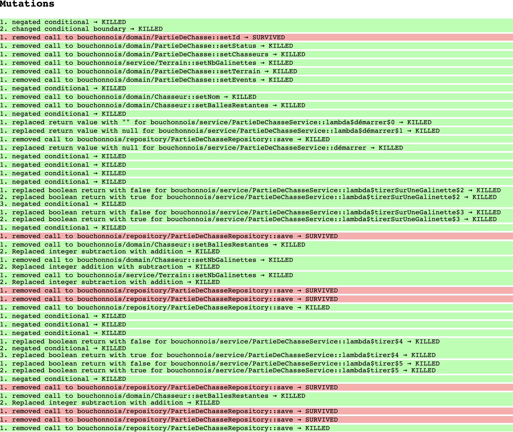
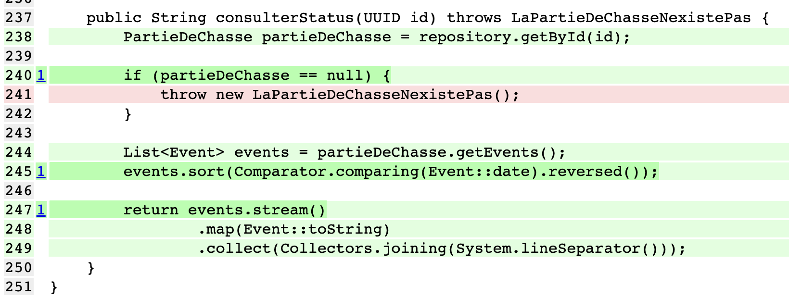
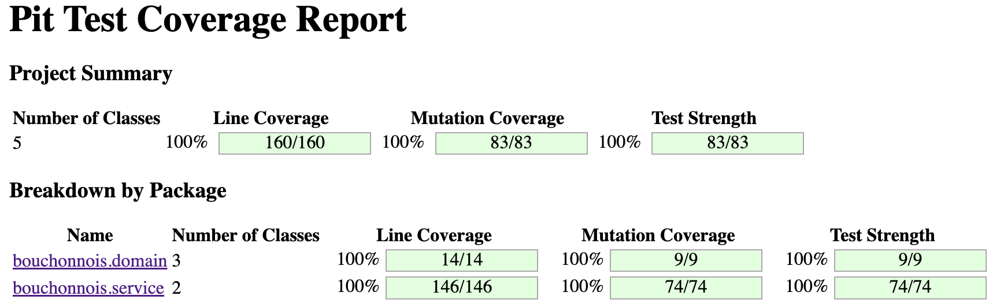

# Let's kill some mutants

Prendre quelques instants pour découvrir la
page [`Mutation Testing`](https://xtrem-tdd.netlify.app/flavours/mutation-testing/).

Durant cette étape:

- Lancer [`pitest`](https://pitest.org/)
    - Analyser les mutants survivants
- `Tuer` autant de mutants que possible (atteindre un score de mutation d'au moins 90%)


## Point de départ



Malgré notre fort `coverage` le score de mutation est très faible: `11%` sur le `domain`...

## `Domain`
De nombreux morceaux de code sont marqués comme `NO_COVERAGE` dûs à l'usage massif de `lombok`...



- On supprime `@Data` qui amène trop de fonctionnalité par rapport à notre besoin

```java
@Getter
@Setter
public class Chasseur {
    private String nom;
    private int ballesRestantes;
    private int nbGalinettes;
}
```

- Cela va réduire drastiquement le nombre de mutations possibles



> On fait de même sur le reste de notre `domain`

## `Service`
On s'intéresse désormais au package `service`



- On commence par travailler sur les annotation sur `Terrain`
  - On a besoin de rajouter le constructeur contenant le `nom` en argument

```java
@Getter
@Setter
public class Terrain {
    private final String nom;
    private int nbGalinettes;

    public Terrain(String nom) {
        this.nom = nom;
    }
}
```

- Maintenant, on peut s'attaquer au `PartieDeChasseService`



- On va tuer ce mutant en renforçant notre test
  - vérifier que le call au `setId` se fait bien

```java
 @Test
void avec_plusieurs_chasseurs() throws ImpossibleDeDémarrerUnePartieSansGalinettes, ImpossibleDeDémarrerUnePartieAvecUnChasseurSansBalle, ImpossibleDeDémarrerUnePartieSansChasseur {
    var repository = new PartieDeChasseRepositoryForTests();
    var service = new PartieDeChasseService(repository, LocalDateTime::now);
    var chasseurs = new ArrayList<Tuple2<String, Integer>>() {{
        add(new Tuple2<>("Dédé", 20));
        add(new Tuple2<>("Bernard", 8));
        add(new Tuple2<>("Robert", 12));
    }};
    var terrainDeChasse = new Tuple2<>("Pitibon sur Sauldre", 3);

    var id = service.démarrer(
            terrainDeChasse,
            chasseurs
    );

    var savedPartieDeChasse = repository.getSavedPartieDeChasse();
    // On vérifier que l'id généré n'est pas null
    assertThat(savedPartieDeChasse.getId()).isNotNull().isEqualTo(id);
    assertThat(savedPartieDeChasse.getStatus()).isEqualTo(PartieStatus.EN_COURS);
    assertThat(savedPartieDeChasse.getTerrain().getNom()).isEqualTo("Pitibon sur Sauldre");
    assertThat(savedPartieDeChasse.getTerrain().getNbGalinettes()).isEqualTo(3);
    assertThat(savedPartieDeChasse.getChasseurs()).hasSize(3);
    assertThat(savedPartieDeChasse.getChasseurs().get(0).getNom()).isEqualTo("Dédé");
    assertThat(savedPartieDeChasse.getChasseurs().get(0).getBallesRestantes()).isEqualTo(20);
    assertThat(savedPartieDeChasse.getChasseurs().get(0).getNbGalinettes()).isZero();
    assertThat(savedPartieDeChasse.getChasseurs().get(1).getNom()).isEqualTo("Bernard");
    assertThat(savedPartieDeChasse.getChasseurs().get(1).getBallesRestantes()).isEqualTo(8);
    assertThat(savedPartieDeChasse.getChasseurs().get(1).getNbGalinettes()).isZero();
    assertThat(savedPartieDeChasse.getChasseurs().get(2).getNom()).isEqualTo("Robert");
    assertThat(savedPartieDeChasse.getChasseurs().get(2).getBallesRestantes()).isEqualTo(12);
    assertThat(savedPartieDeChasse.getChasseurs().get(2).getNbGalinettes()).isZero();
}
```

- Si on jette un oeil aux autres mutants, on se rend compte que `pitest` arrive à retirer l'appel au `save` du repository sans que les tests le détectent



- On change les tests pour faire cette vérification

```java
@Test
void echoue_avec_un_chasseur_nayant_plus_de_balles() {
    var id = UUID.randomUUID();
    var repository = new PartieDeChasseRepositoryForTests();

    var partieDeChasse = new PartieDeChasse() {
        {
            setId(id);
            setChasseurs(new ArrayList<>() {{
                add(new Chasseur() {{
                    setNom("Dédé");
                    setBallesRestantes(20);
                }});
                add(new Chasseur() {{
                    setNom("Bernard");
                    setBallesRestantes(0);
                }});
                add(new Chasseur() {{
                    setNom("Robert");
                    setBallesRestantes(12);
                }});
            }});

            setTerrain(new Terrain("Pitibon sur Sauldre") {{
                setNbGalinettes(3);
            }});
            setStatus(PartieStatus.EN_COURS);
            setEvents(new ArrayList<>());
        }
    };
    repository.add(partieDeChasse);
    var service = new PartieDeChasseService(repository, LocalDateTime::now);

    assertThatThrownBy(() -> service.tirerSurUneGalinette(id, "Bernard"))
            .isInstanceOf(TasPlusDeBallesMonVieuxChasseALaMain.class);

    assertPartieDeChasseHasBeenSaved(repository, partieDeChasse);
}
```

### Amélioration du coverage
- Via ce rapport, on se rend compte qu'il y a une branche qui n'est pas couverte



- Ajoutons le test manquant

```java
@Test
void echoue_car_partie_nexiste_pas() {
    var id = UUID.randomUUID();
    var repository = new PartieDeChasseRepositoryForTests();
    var service = new PartieDeChasseService(repository, LocalDateTime::now);

    assertThatThrownBy(() -> service.consulterStatus(id))
            .isInstanceOf(LaPartieDeChasseNexistePas.class);
    assertThat(repository.getSavedPartieDeChasse()).isNull();
}
```

> Bravo, tous les mutants sont morts



## Reflect

Pour créer de bons tests, il est important de `toujours se concentrer sur l'écriture de bonnes assertions` et encore
mieux développer en utilisant T.D.D.

Lorsqu'on écrit des tests (a priori ou posteriori), il est important d'avoir en tête certains principes tels que
les [Test Desiderata](https://kentbeck.github.io/TestDesiderata/).

